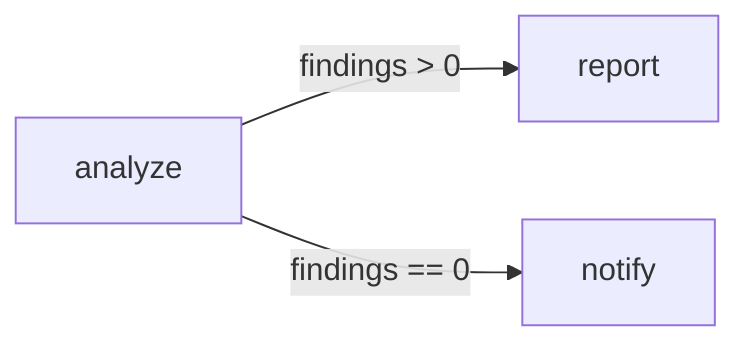

# Conditional Edges

Conditional edges let a workflow choose different next steps based on the current workflow state.

They are how you model decisions such as:

- continue when a score is high enough
- send low-confidence results for review
- retry when a step says it should retry
- route failures into a fallback path

In Spectra, conditions live on edges. After a node finishes, the runner evaluates its outgoing edges in order and takes the **first edge that matches**.

That ordering rule is important.

---

## The basic branching model

A simple branching workflow might look like this:



When `analyze` completes, Spectra evaluates its outgoing edges against the current state:

- if the first condition matches, execution follows that edge
- otherwise it keeps checking the next edge
- if no conditional edge matches, an unconditional edge can act as a fallback
- if nothing matches at all, that path ends there

---

## A simple example

=== "C#"

```csharp
var workflow = WorkflowBuilder.Create("branching-demo")
    .AddNode("analyze", "Analyze")
    .AddNode("report", "Report")
    .AddNode("notify", "Notify")
    .AddEdge("analyze", "report", condition: "nodes.analyze.findings.count > 0")
    .AddEdge("analyze", "notify", condition: "nodes.analyze.findings.count == 0")
    .Build();
```

=== "JSON"

```json
{
  "id": "branching-demo",
  "nodes": [
    { "id": "analyze", "stepType": "Analyze" },
    { "id": "report",  "stepType": "Report"  },
    { "id": "notify",  "stepType": "Notify"  }
  ],
  "edges": [
    { "source": "analyze", "target": "report",  "condition": "nodes.analyze.findings.count > 0"  },
    { "source": "analyze", "target": "notify",  "condition": "nodes.analyze.findings.count == 0" }
  ]
}
```

In this workflow, `analyze` writes data into workflow state, the outgoing edge conditions read from that state, and the workflow continues to either `report` or `notify`. This makes decision logic explicit in the graph rather than buried inside step code.

---

## How conditions are evaluated

Conditions are evaluated against workflow state using dot-separated paths:

- `inputs.*` — incoming workflow values
- `nodes.<nodeId>.*` — node outputs and related data
- `global.*` — shared workflow-wide values

Examples:

```text
nodes.analyze.findings.count > 0
inputs.priority == 'high'
global.retryCount >= 3
```

This path-based model keeps conditions easy to read and easy to debug.

---

## Supported operators

| Operator     | Example                                   | Behavior              |
| ------------ | ----------------------------------------- | --------------------- |
| `==`         | `nodes.check.status == 'Succeeded'`       | Equality              |
| `!=`         | `nodes.check.status != 'Failed'`          | Inequality            |
| `>`          | `nodes.score.value > 0.8`                 | Greater than          |
| `>=`         | `global.retryCount >= 3`                  | Greater than or equal |
| `<`          | `nodes.items.count < 10`                  | Less than             |
| `<=`         | `nodes.score.value <= 0.5`                | Less than or equal    |
| `contains`   | `nodes.message.output contains 'error'`   | Substring match       |
| `startswith` | `inputs.fileName startswith 'test'`       | Prefix match          |
| `endswith`   | `inputs.fileName endswith '.json'`        | Suffix match          |

For most workflows, these are enough to model routing logic clearly.

---

## Null checks

You can compare against `null` directly:

```text
nodes.lookup.output == null
nodes.lookup.output != null
```

This is useful when a previous step may or may not produce a value.

---

## Truthiness checks

A condition can also be just a path by itself:

```text
nodes.isReady.output
nodes.search.results
global.shouldContinue
```

Spectra treats the value as a truthiness check. Common falsy values include `null`, `false`, `0`, empty string, and empty collection. Everything else is treated as truthy.

This is useful for simple yes/no or present/missing branching.

---

## Default edges

An edge without a condition is a default edge. Because Spectra evaluates edges in order and takes the first match, an unconditional edge acts as a fallback:

```csharp
.AddEdge("check", "retry", condition: "nodes.check.needsRetry == true")
.AddEdge("check", "done")
```

In this example: go to `retry` if retry is needed, otherwise go to `done`. This is one of the most common branching patterns in workflow graphs.

---

## Why edge order matters

Since Spectra takes the first matching edge, order is part of the workflow logic:

```csharp
.AddEdge("review", "urgent", condition: "inputs.priority == 'high'")
.AddEdge("review", "normal")
```

A good rule: put the most specific conditions first, and the catch-all edge last.

---

## Branching on step results

A common pattern is to branch on data produced by a previous node:

```text
nodes.classify.output.label == 'invoice'
nodes.score.output.value >= 0.8
nodes.review.output.approved == true
```

This lets the workflow itself encode decision logic instead of forcing every step to contain control-flow code — one of the biggest benefits of graph-based orchestration.

---

## Failure and fallback paths

Conditional edges are also useful for recovery paths. A workflow can branch based on whether a node succeeded, failed, or requested a retry, as long as that information is written into workflow state at a stable path:

```csharp
var workflow = WorkflowBuilder.Create("error-handling")
    .AddNode("risky",    "RiskyOperation")
    .AddNode("fallback", "FallbackHandler")
    .AddNode("next",     "NextStep")
    .AddEdge("risky", "next",     condition: "nodes.risky.status == 'Succeeded'")
    .AddEdge("risky", "fallback", condition: "nodes.risky.status == 'Failed'")
    .Build();
```

This pattern makes recovery visible in the graph itself. See [Runner](../execution/runner.md) for execution and failure behavior.

---

## Debugging branch decisions

When a workflow follows an unexpected branch, condition evaluation should be observable. A branch evaluation event typically includes:

- source node
- target node
- condition expression
- whether it matched
- an explanation of the result

This is especially useful when debugging unexpected routing, false-positive matches, overly broad conditions, or fallback edges firing too often. See [Events](../observability/events.md) for event setup and observability.

---

## Custom condition evaluators

The built-in evaluator is intentionally simple. If you need more advanced logic, you can replace it with your own implementation:

```csharp
public interface IConditionEvaluator
{
    ConditionResult Evaluate(string expression, WorkflowState state);
}
```

A custom evaluator is useful for compound boolean logic, regex matching, custom functions, domain-specific operators, or external lookup-backed evaluation — while keeping the workflow graph model intact.

---

## Practical guidance

Use conditional edges when:

- the workflow should visibly branch in the graph
- routing depends on workflow state
- you want decision logic to stay declarative
- recovery and fallback paths should be explicit

Avoid putting branching logic into opaque step code when the graph itself can express it more clearly.

---

## Where to go next

- [Workflows](workflows.md) — how nodes, edges, and state fit together
- [State](state.md) — how conditions read from workflow data
- [Parallel Execution](parallel-execution.md) — how branching interacts with concurrency
- [Cyclic Graphs](cyclic-graphs.md) — use conditions in retry loops
- [Runner](../execution/runner.md) — runtime execution details
- [Events](../observability/events.md) — inspect branch evaluation and workflow events