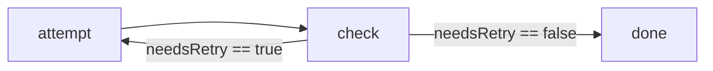
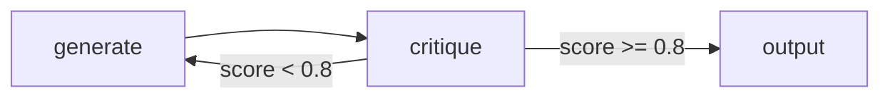

# Cyclic Graphs & Retry Loops

Spectra supports cyclic workflows.

That means a workflow can loop back to an earlier node instead of only moving forward. Cycles are useful for patterns like:

- retry until success
- iterative refinement
- review and revise
- agentic reasoning loops

A cyclic workflow is still just a graph. The difference is that one or more edges point back to a previous node.

---

## The retry loop pattern

The most common cycle is a retry loop:

1. attempt some work
2. inspect the result
3. retry if needed
4. continue when the result is acceptable



This is a natural fit for operations such as:

- retrying an external API call
- rerunning a failed validation step
- repeating a generation step until quality is acceptable
- looping until a human or automated check approves the result

---

## Example

=== "C#"

```csharp
var workflow = WorkflowBuilder.Create("retry-loop")
    .WithMaxNodeIterations(5)
    .AddNode("attempt", "AttemptOperation")
    .AddNode("check",   "CheckResult")
    .AddNode("done",    "FinalizeResult")
    .AddEdge("attempt", "check")
    .AddEdge("check", "attempt", condition: "nodes.check.needsRetry == true", isLoopback: true)
    .AddEdge("check", "done",    condition: "nodes.check.needsRetry == false")
    .Build();
```

=== "JSON"

```json
{
  "id": "retry-loop",
  "maxNodeIterations": 5,
  "nodes": [
    { "id": "attempt", "stepType": "AttemptOperation" },
    { "id": "check",   "stepType": "CheckResult"      },
    { "id": "done",    "stepType": "FinalizeResult"   }
  ],
  "edges": [
    { "source": "attempt", "target": "check"                                                          },
    { "source": "check",   "target": "attempt", "condition": "nodes.check.needsRetry == true", "isLoopback": true },
    { "source": "check",   "target": "done",    "condition": "nodes.check.needsRetry == false" }
  ]
}
```

When `check` finishes, Spectra evaluates its outgoing edges:

- if `nodes.check.needsRetry == true`, execution loops back to `attempt`
- if `nodes.check.needsRetry == false`, execution continues to `done`

---

## What makes a cycle valid

In Spectra, a back edge must be marked as a loopback edge:

```csharp
.AddEdge("check", "attempt",
    condition:  "nodes.check.needsRetry == true",
    isLoopback: true)
```

The `isLoopback` flag tells Spectra that this edge is intentionally part of a cycle. Without it, a backward edge is treated like a normal dependency and the workflow is considered invalid.

The practical rule is simple:

- forward-moving edges are normal edges
- backward-moving edges must be marked with `isLoopback: true`

---

## Every loop needs a stopping rule

**Every cycle needs an exit condition and an iteration limit.**

A loop should stop because:

- the success condition is met
- a branch routes to a terminal node
- the node reaches its maximum allowed iterations

Use `MaxNodeIterations` to cap how many times a node can run in a single workflow execution:

```csharp
var workflow = WorkflowBuilder.Create("safe-loop")
    .WithMaxNodeIterations(10)
    // ...
    .Build();
```

If a node exceeds that limit, the workflow fails instead of looping forever. That protects your system from runaway retries, wasted tokens, and unbounded resource use.

---

## Iterative refinement

Cycles are not only for retries. They are also useful for improve-until-good-enough patterns — one node generates output and another critiques it:



=== "C#"

```csharp
var workflow = WorkflowBuilder.Create("iterative-refinement")
    .WithMaxNodeIterations(3)
    .AddNode("generate", "PromptStep")
    .AddNode("critique", "PromptStep")
    .AddNode("output",   "FinalOutput")
    .AddEdge("generate", "critique")
    .AddEdge("critique", "generate", condition: "nodes.critique.score < 0.8",  isLoopback: true)
    .AddEdge("critique", "output",   condition: "nodes.critique.score >= 0.8")
    .Build();
```

This pattern works well for:

- draft → critique → revise loops
- structured output repair
- response improvement against quality thresholds
- iterative reasoning workflows

The iteration cap keeps the loop bounded even when the target quality is not reached.

---

## Cycles and workflow state

Loop conditions usually read from values written by earlier nodes:

```text
nodes.check.needsRetry == true
nodes.critique.score < 0.8
nodes.validate.output.isValid == false
```

This is why cyclic workflows still feel predictable: the loop condition is visible on the edge and the decision comes from state. That makes retry and refinement logic easier to understand than burying it inside step code.

---

## Cycles in larger workflows

A cycle does not have to be the whole workflow. You can have:

- one retry loop inside a larger linear workflow
- multiple looping regions in the same graph
- loops inside parallel branches
- loop exits that continue into downstream processing

For example, a workflow might fetch source data, run an extraction loop until valid, then continue into classification and reporting. The cyclic section is just one part of the graph.

---

## Cycles and parallel execution

Cycles can coexist with parallel branches. A workflow can fan out into multiple branches, retry inside one or more of them, and continue once each branch reaches its own completion condition.

The important things to remember:

- loopback conditions are reevaluated during execution
- iteration limits still apply
- join behavior still matters when looped branches feed into later nodes

See [Parallel Execution](parallel-execution.md) for the concurrency side of the model.

---

## Common mistake: forgetting `isLoopback`

A backward edge is not automatically treated as a valid retry loop. You must mark it explicitly:

```csharp
.AddEdge("check", "attempt",
    condition:  "nodes.check.needsRetry == true",
    isLoopback: true)
```

Without that, Spectra treats the graph as an invalid cycle.

---

## Common mistake: forgetting the exit path

A loopback edge alone is not enough. A safe cyclic workflow needs:

- a loopback edge for the retry path
- a non-looping edge for the success or exit path
- an iteration cap as a final safety guard

That combination makes the workflow both expressive and safe.

---

## Graph cycles vs agent handoff cycles

Spectra has more than one kind of cycle, and it helps to keep them separate.

| Mechanism                              | Scope              | Purpose                                                   |
| -------------------------------------- | ------------------ | --------------------------------------------------------- |
| `isLoopback` + `MaxNodeIterations`     | workflow graph     | retry loops, refinement loops, graph-level repetition     |
| agent cycle policies                   | agent handoff chains | control whether agents can revisit earlier agents       |

This page is about graph-level cycles. If you are working with multi-agent handoffs, that is a separate mechanism with its own policies and limits. See the multi-agent docs for handoff cycle behavior.

---

## Practical guidance

Use cyclic graphs when:

- retries should be visible in the workflow
- iteration is part of the process, not a hidden implementation detail
- refinement or validation loops need explicit control flow
- you want limits and exit paths defined at the graph level

Avoid cycles when a simple linear flow is enough. A loop is powerful, but it should make the workflow clearer, not harder to reason about.

---

## Where to go next

- [Conditional Edges](conditional-edges.md) — branch into retry or exit paths
- [Parallel Execution](parallel-execution.md) — combine loops with concurrent branches
- [State](state.md) — how loop conditions read workflow data
- [Agent Step](../llm/agent-step.md) — internal agent iterations vs graph-level cycles
- [Runner](../execution/runner.md) — workflow execution behavior and failure handling