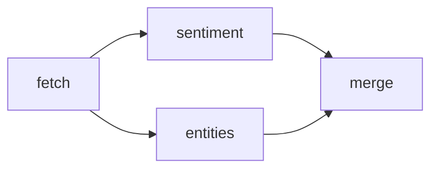

# Parallel Execution

Spectra can run independent workflow branches in parallel through `ParallelScheduler`.

When one node unlocks multiple downstream branches, the parallel scheduler can execute those branches concurrently without extra annotations on the edges. You define the graph. Spectra derives the available parallelism from that graph.

This is especially useful for workloads like:

- parallel analysis
- fan-out enrichment
- multiple tool or API calls
- independent validation steps
- multi-branch LLM processing

---

## The fan-out / fan-in pattern

The most common parallel pattern is:

- one node finishes
- several independent branches start at the same time
- a later node joins those branches back together



In this example:

- `fetch` produces shared input data
- `sentiment` and `entities` can run independently
- `merge` combines the results

---

## Example

=== "C#"

```csharp
var workflow = WorkflowBuilder.Create("parallel-analysis")
    .AddNode("fetch",     "FetchData")
    .AddNode("sentiment", "SentimentAnalysis")
    .AddNode("entities",  "EntityExtraction")
    .AddNode("merge",     "MergeResults", node => node.WaitForAll())
    .AddEdge("fetch",     "sentiment")
    .AddEdge("fetch",     "entities")
    .AddEdge("sentiment", "merge")
    .AddEdge("entities",  "merge")
    .Build();
```

=== "JSON"

```json
{
  "id": "parallel-analysis",
  "nodes": [
    { "id": "fetch",     "stepType": "FetchData"           },
    { "id": "sentiment", "stepType": "SentimentAnalysis"   },
    { "id": "entities",  "stepType": "EntityExtraction"    },
    { "id": "merge",     "stepType": "MergeResults", "waitForAll": true }
  ],
  "edges": [
    { "from": "fetch",     "to": "sentiment" },
    { "from": "fetch",     "to": "entities"  },
    { "from": "sentiment", "to": "merge"     },
    { "from": "entities",  "to": "merge"     }
  ]
}
```

When `fetch` completes, both `sentiment` and `entities` become ready. Because neither depends on the other, Spectra can run them concurrently. The `merge` node then joins those branches.

---

## Join behavior: WaitForAll

When a node has multiple incoming edges, its join behavior matters.

`WaitForAll` controls whether the node should run after the first completed upstream branch, or after all upstream branches have completed.

| Setting | Behavior                                        | Typical use                       |
| ------- | ----------------------------------------------- | --------------------------------- |
| `false` | Run when any incoming path makes the node ready | fastest-path wins, optional paths |
| `true`  | Wait until all incoming branches have completed | merge/join nodes, combined results |

For most fan-in nodes, you want `WaitForAll()`:

```csharp
.AddNode("merge", "MergeResults", node => node.WaitForAll())
```

Without it, a merge node may run too early, before the other branch outputs are available. That is one of the easiest mistakes to make in parallel workflows.

---

## When branches actually run in parallel

Parallel execution happens when multiple nodes are ready at the same time and do not depend on one another:

- one node fans out to two or more children
- separate branches are both ready after earlier work completes
- no edge forces one branch to wait for another

In other words, parallelism comes from the graph structure itself. You do not mark edges as "parallel." You model independent work, and execute the workflow with `ParallelScheduler`.

---

## State in parallel branches

Parallel nodes still share the same workflow state.

### Safe independent writes

The simplest pattern is for each branch to write to its own output path:

```text
nodes.sentiment.output
nodes.entities.output
```

This is easy to reason about and works well for most fan-out flows.

### Shared-key writes need care

If multiple branches write to the same state key, you need to decide how those values should be combined. The parallel scheduler applies outputs under a lock, so shared-key writes are effectively last-write-wins — acceptable for some cases, but not for result aggregation.

For deterministic merging, have each branch write its own output and combine those values in an explicit fan-in node.

State reducer registration exists in Spectra, but `ParallelScheduler` does not apply reducers when writing branch outputs today.

---

## Tuning concurrency

You can control how much parallel work `ParallelScheduler` allows at once with its `maxConcurrency` constructor argument:

```csharp
var scheduler = new ParallelScheduler(
    stepRegistry,
    eventSink: eventSink,
    maxConcurrency: 8);
```

Choose a limit based on the kind of work your nodes are doing:

- **CPU-heavy work** usually benefits from lower concurrency
- **I/O-heavy work** such as API calls or model requests can often use higher concurrency
- **rate-limited external services** may need stricter limits to avoid throttling

---

## Practical patterns

Parallel execution is especially useful for patterns like these.

### Parallel analysis

Run several analysis steps over the same source material — summarize, classify, extract entities, score risk — all at once.

### Fan-out enrichment

Fetch one base record, then enrich it with data from several services in parallel.

### Multi-check validation

Run independent checks simultaneously, then combine the outcome into one decision.

### LLM branch comparison

Generate or evaluate multiple responses in parallel, then route to a later selection or merge step.

These patterns are where graph orchestration starts to feel much more powerful than linear step execution.

---

## What happens at runtime

At a high level, Spectra:

1. determines which nodes are ready to run
2. groups independent ready nodes into parallel work
3. applies concurrency limits
4. executes the batch
5. updates workflow state
6. checks which nodes become ready next

The important guarantee for users is:

- independent branches can progress concurrently
- join behavior is controlled by the receiving node
- state consistency and execution order are handled by the runtime

---

## Observability

Parallel execution should be visible. At a minimum, you want to be able to answer:

- which nodes ran together?
- how long did a parallel batch take?
- which branch failed?
- did a join node wait for all required inputs?

Spectra exposes workflow and step events that make these questions easier to answer. See [Events](../observability/events.md) for instrumentation and event handling.

---

## Common mistake: forgetting the join behavior

A node with multiple incoming edges does **not** automatically mean "wait for every branch."

For join or merge nodes, make the behavior explicit:

```csharp
.AddNode("merge", "MergeResults", node => node.WaitForAll())
```

If you do not, the node may run earlier than you expect.

---

## Where to go next

- [Workflows](workflows.md) — how graph structure defines execution
- [State](state.md) — how branch outputs are stored and merged
- [Conditional Edges](conditional-edges.md) — combine branching with parallel flows
- [Cyclic Graphs](cyclic-graphs.md) — iterative and retry patterns
- [Runner](../execution/runner.md) — execution lifecycle and runtime behavior
- [Events](../observability/events.md) — inspect workflow execution and parallel batches
