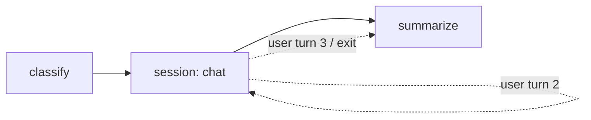

# Sessions & Dialogue

Use `SessionStep` when a workflow needs a real conversation.

Unlike `AgentStep`, a session does not run to completion in one execution. It handles one user turn, suspends, waits for the next user message, and resumes later.

**StepType:** `"session"`

| Use case | Step |
| --- | --- |
| Autonomous tool-using work | `AgentStep` |
| Human↔AI multi-turn dialogue | `SessionStep` |

---

## What a session is

A session turns one node in your workflow into a **persistent dialogue boundary**.

That means the workflow can:

- enter a conversation
- pause between user turns
- keep history across pauses
- exit when the conversation is complete
- continue to the next nodes in the graph



The nodes before and after the session are normal workflow steps.

The session node is where the conversation lives.

---

## Why use `SessionStep`

### Dialogue inside a workflow

A workflow can mix pipelines and conversations.

For example:

1. classify a request
2. gather information through dialogue
3. process the result
4. confirm with the user
5. continue the workflow

This lets you build flows like onboarding, support, approval, and guided intake without separating "chat" from "orchestration".

### Efficient waiting

When a session is waiting for the next user message, it does not keep compute resources busy.

Instead, Spectra:

- checkpoints the workflow state
- stores the conversation history
- resumes when the next message arrives

This makes long-lived conversations practical.

### Full agent loop per turn

Each user turn can still use tools internally.

So a single session turn can:

- call an LLM
- invoke tools
- observe results
- produce a final response to the user

The user sees one response, even if the system performed several tool calls behind the scenes.

---

## Basic usage

```csharp
services.AddSpectra(builder =>
{
    builder.AddProvider<OpenAiCompatibleProvider>("openai", new OpenAiConfig
    {
        ApiKey = "sk-...",
        DefaultModel = "gpt-4o"
    });

    builder.AddAgent("support", agent => agent
        .WithProvider("openai")
        .WithSystemPrompt("You are a helpful customer support agent.")
        .WithTools("lookup_order", "check_inventory", "create_ticket"));
});

var workflow = Spectra.Workflow("support-chat")
    .AddSessionStep("chat", agent: "support", options: new
    {
        greetingPrompt = "Hello! How can I help you today?",
        maxTurns = 30,
        exitPolicies = SessionExitPolicy.LlmDecides | SessionExitPolicy.UserCommand
    })
    .Build();
```

This is the common pattern:

- register an agent
- add a session step
- configure greeting, turn limit, and exit rules

---

## How a session runs

A session has three main phases.

### 1. First entry

When the workflow reaches the session for the first time, it can generate a greeting and then suspend waiting for user input.

### 2. Each user turn

For every new user message, the session:

1. appends the message to history
2. runs the internal agent loop for that turn
3. appends the assistant response
4. checks exit conditions
5. either suspends again or finishes

### 3. Exit

When an exit policy triggers, the session returns success with outputs like:

- full conversation history
- turn count
- exit reason

Then the workflow continues through its outgoing edges.

---

## Exit policies

Exit policies control when the conversation ends.

You can combine multiple policies, and the first one that triggers ends the session.

| Policy | Value | How It Works |
| --- | --- | --- |
| `LlmDecides` | `1` | The LLM calls an auto-injected `end_session` tool |
| `UserCommand` | `2` | The user types a command like `/done`, `/exit`, or `/quit` |
| `Condition` | `4` | A workflow state condition becomes true |
| `MaxTurns` | `8` | The session reaches `maxTurns` |
| `TokenBudget` | `16` | The cumulative token budget is reached |
| `Timeout` | `32` | The session exceeds its configured lifetime |
| `External` | `64` | An external API call ends the session |

Example:

```csharp
var policies = SessionExitPolicy.LlmDecides
             | SessionExitPolicy.UserCommand
             | SessionExitPolicy.MaxTurns
             | SessionExitPolicy.Timeout;
```

A practical default is:

- let the LLM end naturally
- allow the user to exit explicitly
- keep a hard turn limit as a safety net

### `end_session`

When `LlmDecides` is enabled, Spectra injects an `end_session` tool for the model.

The tool is intercepted internally. It does not go through the normal tool registry.

---

## History management

Long conversations need history control.

Spectra supports these strategies:

| Strategy | Behavior | When to Use |
| --- | --- | --- |
| `Full` | Keep all messages | Short conversations |
| `SlidingWindow` | Keep only the last N messages | Longer conversations |
| `Summarize` | Summarize older messages | Not yet implemented |

Example:

```csharp
.AddSessionStep("chat", agent: "support", options: new
{
    historyStrategy = "SlidingWindow",
    maxHistoryMessages = 40
})
```

History is persisted with the workflow state, so it survives checkpointing and resume.

---

## Main inputs

All normal LLM inputs still apply, such as `agent`, `provider`, `model`, `temperature`, and `maxTokens`.

These inputs are specific to sessions:

| Input | Type | Default | Description |
| --- | --- | --- | --- |
| `userMessage` | `string` | — | Current user message on resume |
| `tools` | `List<string>` | — | Tool whitelist for the session |
| `maxIterations` | `int` | `10` | Max tool-calling rounds per turn |
| `__greetingPrompt` | `string` | — | Initial greeting template |
| `__exitPolicies` | `int` | `9` | Combined `SessionExitPolicy` flags |
| `__maxTurns` | `int` | `50` | Hard turn limit |
| `__tokenBudget` | `int` | `0` | Total token budget across the session |
| `__timeout` | `double` | `0` | Timeout in seconds from first entry |
| `__exitCondition` | `string` | — | State key for condition-based exit |
| `__historyStrategy` | `string` | `"Full"` | `Full`, `SlidingWindow`, or `Summarize` |
| `__maxHistoryMessages` | `int` | `100` | Window size for sliding history |
| `__exitCommands` | `List<string>` | `["/done", "/exit", "/quit"]` | Commands that trigger user exit |

!!! info
    Inputs starting with `__` configure session behavior. They are not sent to the LLM.

---

## Outputs

When the session ends successfully, these outputs are available to downstream nodes:

| Output | Type | Description |
| --- | --- | --- |
| `response` | `string?` | Last assistant response |
| `messages` | `List<LlmMessage>` | Full conversation history |
| `turnCount` | `int` | Total completed turns |
| `totalInputTokens` | `int` | Total prompt tokens across turns |
| `totalOutputTokens` | `int` | Total completion tokens across turns |
| `exitReason` | `string?` | Why the session ended |

These outputs make sessions composable with the rest of the graph.

For example, a later node can use:

```text
{{nodes.chat.output.messages}}
```

to process the full conversation.

---

## Events

Sessions emit events for monitoring and analytics.

| Event | When |
| --- | --- |
| `SessionTurnCompletedEvent` | After each turn |
| `SessionAwaitingInputEvent` | When the session suspends |
| `SessionCompletedEvent` | When the session ends |

---

## Common patterns

### Conversation → pipeline → conversation

A common design is:

1. gather information through dialogue
2. process it in the workflow
3. return to the user for review or confirmation

```csharp
var workflow = Spectra.Workflow("onboarding")
    .AddSessionStep("interview", agent: "interviewer", options: new { ... })
    .AddAgentStep("process", agent: "processor", inputs: new
    {
        userPrompt = "Process this application: {{nodes.interview.output.messages}}"
    })
    .AddSessionStep("review", agent: "reviewer", options: new
    {
        greetingPrompt = "Here's your processed application: {{nodes.process.output.response}}. Look good?"
    })
    .Edge("interview", "process")
    .Edge("process", "review")
    .Build();
```

### Conditional exit routing

You can branch the workflow based on how the conversation ended.

```csharp
var workflow = Spectra.Workflow("support")
    .AddSessionStep("chat", agent: "support", options: new { ... })
    .AddStep("escalate", new EscalateStep(), ...)
    .AddStep("close", new CloseTicketStep(), ...)
    .ConditionalEdge("chat", new()
    {
        ["{{nodes.chat.output.exitReason}} == 'max_turns'"] = "escalate",
        ["default"] = "close"
    })
    .Build();
```

---

## SessionStep vs AgentStep

| | `AgentStep` | `SessionStep` |
| --- | --- | --- |
| Interaction model | Autonomous | Interactive |
| Execution style | Runs to completion | Suspends between turns |
| Driver | The LLM | The human |
| Duration | Seconds to minutes | Minutes to days |
| State between calls | Single execution | Checkpointed and resumable |
| Best for | Task completion and processing | Chat, intake, support, onboarding |
| Tools | Used autonomously | Used inside each user turn |
| Exit | Model stops calling tools | Exit policies |

A simple mental model:

- **`AgentStep` is a worker**
- **`SessionStep` is a conversation**