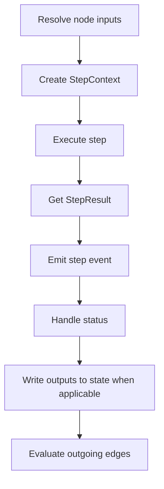

# Steps

A step is the unit of work that runs inside a workflow node.

When Spectra reaches a node during execution, it runs the step inside that node, collects the result, writes outputs into state when appropriate, and then decides what should happen next.

A step can do almost anything, including:

- call an LLM
- transform data
- query an external system
- run an autonomous agent
- pause for human input
- execute a nested workflow

While nodes define the shape of the graph, steps are the thing that actually does the work.

---

## The core idea

A useful way to think about Spectra:

- a **workflow** is a graph
- a **node** is a place in that graph
- a **step** is the behavior that runs at that place
- a **result** tells the engine what to do next

That separation lets you reuse the same kind of step in different workflow shapes.

---

## The `IStep` contract

Every step implements a small interface:

```csharp
public interface IStep
{
    string StepType { get; }
    Task<StepResult> ExecuteAsync(StepContext context);
}
```

| Member | Purpose |
| --- | --- |
| `StepType` | String identifier used for registration, lookup, and serialization |
| `ExecuteAsync` | Runs the step and returns a `StepResult` |

The runtime behavior comes from the context you receive and the result you return.

---

## What a step receives: `StepContext`

When Spectra executes a step, it passes a `StepContext` containing everything the step needs to run: identity, resolved inputs, workflow state, services, cancellation, streaming hooks, interrupt support, and observability data.

### Identity

| Property | Description |
| --- | --- |
| `RunId` | Unique ID for the current workflow run |
| `WorkflowId` | The workflow being executed |
| `NodeId` | The specific node running this step |

### Data

| Property | Description |
| --- | --- |
| `Inputs` | Resolved input values for the step |
| `State` | The full workflow state for the current run |

By the time your step receives `Inputs`, template expressions have already been resolved. If a node input contains `{{nodes.fetch.output}}`, your step sees the actual resolved value, not the expression.

### Services and execution context

| Property | Description |
| --- | --- |
| `Services` | Access to the DI container |
| `RunContext` | Caller metadata such as tenant, user, roles, claims, and custom run metadata |
| `WorkflowDefinition` | The current workflow definition when available |
| `Memory` | Optional long-term memory store |

### Execution mode

| Property | Description |
| --- | --- |
| `CancellationToken` | Signals cancellation and should always be honored |
| `OnToken` | Callback for streaming token chunks |
| `IsStreaming` | Indicates whether streaming is active |

### Control flow

| Property | Description |
| --- | --- |
| `Interrupt` | Low-level interrupt hook |
| `InterruptAsync(...)` | Pause execution and wait for external input |

### Observability

| Property | Description |
| --- | --- |
| `TracingActivity` | The current tracing activity for custom tags, spans, and events |

A step does not need to know about the whole engine. It gets a focused execution context and returns a focused result.

---

## What a step returns: `StepResult`

A step returns a `StepResult` to tell Spectra what happened:

```csharp
public class StepResult
{
    public required StepStatus Status { get; init; }
    public Dictionary<string, object?> Outputs { get; init; } = [];
    public string? ErrorMessage { get; init; }
    public Exception? Exception { get; init; }
    public TimeSpan Duration { get; init; }
    public AgentHandoff? Handoff { get; init; }
}
```

The two most important parts are `Status`, what happened, and `Outputs`, what data the step produced. For normal successful execution, outputs are written into workflow state and become available to downstream nodes.

---

## Use the factory helpers

Instead of constructing `StepResult` manually, use the built-in helpers:

```csharp
StepResult.Success(new Dictionary<string, object?> { ["count"] = 42 });

StepResult.Fail("API returned 500", exception);

StepResult.NeedsContinuation("Batch 1 of 3 complete");

StepResult.Interrupted("Awaiting manager approval");

StepResult.HandoffTo(handoff, outputs);

StepResult.AwaitingInput(outputs);
```

---

## What each status means

`StepStatus` controls how the engine continues.

### Success and failure

| Status | Meaning |
| --- | --- |
| `Succeeded` | The step completed successfully and its outputs are written to state |
| `Failed` | The step failed and the engine records the error |
| `Skipped` | Status value exists; the sequential runner currently treats it like a non-failed result |

### Continue or repeat

| Status | Meaning |
| --- | --- |
| `NeedsContinuation` | The workflow checkpoints and stops; resume continues at the same node |
| `Handoff` | Control is transferred to another agent |
| `AwaitingInput` | The workflow pauses until a new user message arrives |

### Pause and resume

| Status | Meaning |
| --- | --- |
| `Interrupted` | Execution pauses until external input resumes the workflow |

`StepResult` is more than an output container. It is also a control-flow signal to the engine.

---

## Step lifecycle

When the engine reaches a node, the step lifecycle looks like this:



1. Spectra resolves node inputs from workflow state
2. it builds the `StepContext`
3. it calls `ExecuteAsync`
4. it emits `StepCompletedEvent` or `StepInterruptedEvent`
5. it handles the returned `StepStatus`
6. it writes outputs into workflow state when the status continues execution
7. it evaluates the next edges in the graph

Statuses such as `Failed`, `Interrupted`, and `NeedsContinuation` stop before normal output application. `AwaitingInput` applies outputs before pausing.

---

## Async, cancellation, and streaming

All steps are asynchronous.

### Cancellation

Always honor the cancellation token:

```csharp
public async Task<StepResult> ExecuteAsync(StepContext context)
{
    var response = await _httpClient.GetAsync(url, context.CancellationToken);
    context.CancellationToken.ThrowIfCancellationRequested();

    var result = await ProcessAsync(response, context.CancellationToken);

    return StepResult.Success(new()
    {
        ["result"] = result
    });
}
```

This is especially important for long-running or externally dependent work.

### Streaming

Steps that produce incremental text can stream token chunks back to the caller:

```csharp
if (context.IsStreaming)
{
    foreach (var chunk in chunks)
    {
        await context.OnToken!(chunk, context.CancellationToken);
    }
}
```

Built-in `PromptStep`, `AgentStep`, and `SessionStep` support streaming directly.

---

## Interrupts and human input

A step can pause execution and wait for external input:

```csharp
var response = await context.InterruptAsync("review-needed", b => b
    .WithTitle("Review Required")
    .WithPayload(new { document = "draft-v2.md" }));

var approved = response.Payload["approved"];
```

This is useful for workflows that need manager approval, manual review, human validation, or external confirmation before continuing. When a step interrupts, the workflow can be checkpointed and resumed later.

See [Interrupts](interrupts.md) for the full model.

---

## Built-in step types

Spectra includes several built-in step types.

### LLM and agent steps

| Step | StepType | Purpose | Guide |
| --- | --- | --- | --- |
| `PromptStep` | `"prompt"` | Single LLM completion with prompt resolution and optional streaming | [Prompt Steps](../llm/prompt-steps.md) |
| `StructuredOutputStep` | `"structured_output"` | LLM response constrained to structured JSON output | [Prompt Steps](../llm/prompt-steps.md) |
| `AgentStep` | `"agent"` | Autonomous tool-using agent loop | [Agent Step](../llm/agent-step.md) |

### Orchestration steps

| Step | StepType | Purpose | Guide |
| --- | --- | --- | --- |
| `SubgraphStep` | `"subgraph"` | Run a nested workflow inside a parent workflow | [Subgraphs](../advanced/subgraphs.md) |

`SubgraphStep` depends on `IWorkflowRunner`, so register it explicitly in applications that use subgraph nodes.

### Memory steps

| Step | StepType | Purpose | Guide |
| --- | --- | --- | --- |
| `MemoryStoreStep` | `"memory.store"` | Persist data into long-term memory | [Memory & Threading](memory-threading.md#memory-steps) |
| `MemoryRecallStep` | `"memory.recall"` | Read data back from long-term memory | [Memory & Threading](memory-threading.md#memory-steps) |

### Session-based interaction

| Step | StepType | Purpose | Guide |
| --- | --- | --- | --- |
| `SessionStep` | `"session"` | Persistent conversational boundary over turns | [Sessions](sessions.md) |

`SessionStep` represents a different interaction style, a persistent conversational boundary rather than a one-shot unit of work. See [Sessions](sessions.md) for that model.

---

## When to create a custom step

Create your own step when you want a reusable unit of work that does not fit the built-in types. Common reasons include:

- custom API integrations
- business-specific transformation logic
- special validation or routing behavior
- proprietary tools or services
- domain-specific execution patterns

A custom step is often the best way to keep workflow graphs clean while moving implementation detail into normal .NET code.

---

## Practical guidance

- put graph structure in the workflow
- put reusable work in steps
- return clear outputs
- keep control-flow intent explicit through `StepResult`

A good step should be easy to understand in isolation and easy to compose into larger workflows.

---

## Where to go next

- **Use built-in LLM steps** — see [Prompt Steps](../llm/prompt-steps.md)
- **Build autonomous agents** — see [Agent Step](../llm/agent-step.md)
- **Create your own reusable step type** — see [Custom Step Guide](../guides/custom-step.md)
- **Work with conversation-style execution** — see [Sessions](sessions.md)
- **Compose workflows from smaller workflows** — see [Subgraphs](../advanced/subgraphs.md)

It also helps to read [State](state.md) and [Parallel Execution](parallel-execution.md) next, since steps become much easier to use once you understand how data flow and scheduling work together.
