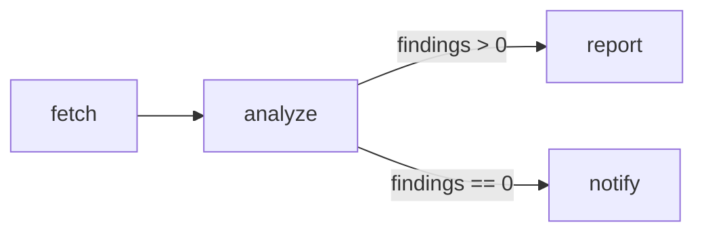
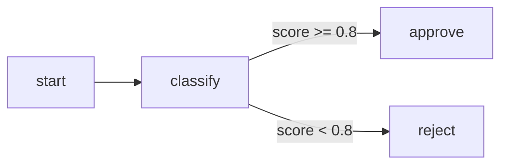
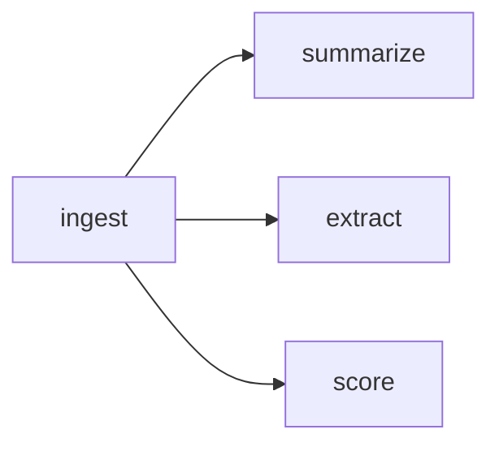
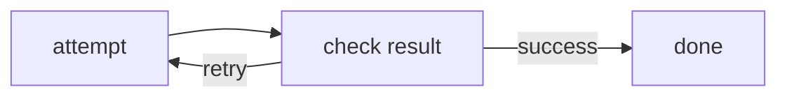

# Workflows & Graphs

A Spectra workflow is a graph of steps.

Each **node** does work.  
Each **edge** defines what can run next.  
**State** carries data through the workflow.

That is the core model behind everything else in Spectra.



In practice, this gives you a workflow that is easy to read, easy to debug, and easy to change. You can start with a small linear flow, then add branching, retries, parallel work, subgraphs, or agent coordination without changing the underlying model.

---

## The three building blocks

### Nodes

A node wraps a [step](steps.md), which is a unit of work.

A step can be:

- an LLM prompt
- an autonomous agent
- a code-based operation
- a human approval gate
- a subgraph
- a custom step you provide

Each node has an ID and a step type. During execution, the runner invokes the node, records its result, and writes outputs back into workflow state.

### Edges

An edge connects one node to another.

Edges define the possible paths through the workflow:

- **unconditional edges** always continue to the next node
- **conditional edges** continue only when their condition matches the current state

After a node finishes, Spectra evaluates its outgoing edges and determines what should run next.

See [Conditional Edges](conditional-edges.md) for branching behavior and condition syntax.

### State

State is the shared data that moves through the workflow.

A workflow usually starts with input values such as:

```text
inputs.userQuery
inputs.customerId
inputs.document
```

As nodes run, they write outputs back into state. Later nodes can reference those values with template expressions such as:

```text
{{nodes.fetch.output}}
{{nodes.analyze.summary}}
{{inputs.userQuery}}
```

This is what makes workflows composable: each step can build on what earlier steps produced.

See [State](state.md) for state structure, reducers, schemas, and mapping.

---

## A simple workflow

Here is a small workflow with two steps:

1. fetch some data
2. analyze the result

=== "C#"

    ```csharp
    var workflow = WorkflowBuilder.Create("my-pipeline")
        .WithName("My Pipeline")
        .AddNode("fetch", "FetchData")
        .AddNode("analyze", "Analyze")
        .AddEdge("fetch", "analyze")
        .Build();
    ```

=== "JSON"

    ```json
    {
      "id": "my-pipeline",
      "name": "My Pipeline",
      "nodes": [
        { "id": "fetch", "stepType": "FetchData" },
        { "id": "analyze", "stepType": "Analyze" }
      ],
      "edges": [
        { "source": "fetch", "target": "analyze" }
      ]
    }
    ```

Both definitions describe the same graph.

Use **C#** when you want workflow definitions close to application code and want full IDE support.

Use **JSON** when you want workflows to be easier to edit, review, version, or load at runtime.

---

## Building workflows in C#

`WorkflowBuilder` is the main entry point for code-first workflow definitions.

A typical workflow definition looks like this:

```csharp
var workflow = WorkflowBuilder.Create("content-pipeline")
    .WithName("Content Pipeline")
    .AddNode("draft", "DraftContent")
    .AddNode("review", "ReviewContent")
    .AddNode("publish", "PublishContent")
    .AddEdge("draft", "review")
    .AddEdge("review", "publish")
    .Build();
```

This gives you a `WorkflowDefinition` that can be executed by the runtime.

Code-first workflows are useful when you want:

- refactoring support
- compile-time discoverability
- workflow definitions close to your app logic
- easier reuse through normal .NET code

---

## Building workflows in JSON

JSON workflows are useful when you want definitions outside compiled code.

That is helpful when you want to:

- edit workflows without recompiling
- store workflow files in Git
- review changes as configuration
- load workflows dynamically at runtime

Spectra can load JSON workflows with `JsonFileWorkflowStore`.

```csharp
var store = new JsonFileWorkflowStore("./workflows");
var workflow = store.Get("content-pipeline")
    ?? throw new InvalidOperationException("Workflow not found.");
```

The runtime executes the same `WorkflowDefinition` shape regardless of whether it came from C# or JSON.

---

## Running a workflow

To execute a workflow, resolve `IWorkflowRunner` from the DI container and call `RunAsync`:

```csharp
var runner = host.Services.GetRequiredService<IWorkflowRunner>();
var result = await runner.RunAsync(workflow, initialState, cancellationToken);
```

The runner executes the graph and returns the final workflow state.

That final state contains:

- the original inputs
- outputs written by nodes
- any accumulated workflow data produced during the run

For example, a workflow might begin with:

```csharp
var state = new WorkflowState
{
    ["inputs.name"] = "World"
};
```

and later produce values such as:

```text
nodes.greet.output
nodes.translate.output
```

This shared-state model is what allows later nodes to depend on earlier work without tight coupling.

See [Runner](../execution/runner.md) for execution details.

---

## Branching and conditions

A workflow does not have to be linear.

You can branch based on state:



In Spectra, that branching logic lives on edges.

=== "C#"

    ```csharp
    var workflow = WorkflowBuilder.Create("decision-flow")
        .AddNode("classify", "Classify")
        .AddNode("approve", "Approve")
        .AddNode("reject", "Reject")
        .AddEdge("classify", "approve", condition: "score >= 0.8")
        .AddEdge("classify", "reject", condition: "score < 0.8")
        .Build();
    ```

=== "JSON"

    ```json
    {
      "id": "decision-flow",
      "nodes": [
        { "id": "classify", "stepType": "Classify" },
        { "id": "approve", "stepType": "Approve" },
        { "id": "reject", "stepType": "Reject" }
      ],
      "edges": [
        { "source": "classify", "target": "approve", "condition": "score >= 0.8" },
        { "source": "classify", "target": "reject", "condition": "score < 0.8" }
      ]
    }
    ```

See [Conditional Edges](conditional-edges.md) for the full condition model.

---

## Parallel execution

When a workflow fans out into independent branches, Spectra can run those branches concurrently.



This is useful for patterns like:

- parallel analysis
- fan-out enrichment
- multi-check validation
- independent tool calls

You define the graph structure. Spectra derives the concurrency from the graph.

See [Parallel Execution](parallel-execution.md) for fan-out and fan-in patterns.

---

## Cycles and retry loops

Spectra also supports cyclic graphs.

That lets you model patterns such as:

- retry until success
- iterative refinement
- review and revise loops
- agentic reasoning cycles

A simplified retry loop looks like this:



Cycles need clear stopping rules. In practice, that usually means iteration limits, explicit success conditions, or both.

See [Cyclic Graphs](cyclic-graphs.md) for loop patterns and safety guards.

---

## How Spectra thinks about workflows

If you are new to Spectra, this mental model will help:

- a **step** is the actual unit of work
- a **node** places that step into a workflow graph
- an **edge** defines a possible transition
- **state** is the shared memory of the run
- the **runner** executes the graph

This separation matters because it lets you reuse the same kinds of steps in many different workflow shapes.

---

## `WorkflowDefinition` at a glance

A workflow definition typically includes these parts:

| Property                  | Description                                    |
| ------------------------- | ---------------------------------------------- |
| `Id`                      | Unique workflow identifier                     |
| `Name`                    | Human-readable workflow name                   |
| `Description`             | Optional description                           |
| `EntryNodeId`             | The node where execution begins                |
| `Nodes`                   | The nodes in the graph                         |
| `Edges`                   | The connections between nodes                  |
| `Agents`                  | Agent definitions used by agent nodes          |
| `StateFields`             | Optional schema information for workflow state |
| `Subgraphs`               | Nested workflow definitions                    |
| `MaxConcurrency`          | Concurrency limit for parallel execution       |
| `DefaultTimeout`          | Default timeout applied during execution       |
| `MaxNodeIterations`       | Safety guard for cyclic execution              |
| `GlobalTokenBudget`       | Optional token budget across agent activity    |
| `MaxHandoffChainDepth`    | Limit for agent handoff depth                  |
| `MaxTotalAgentIterations` | Limit for total agent iterations               |

For the concrete shape, see the runtime contracts and JSON examples throughout the docs.

---

## Choosing C# or JSON

Both approaches are first-class.

Choose **C#** when you want:

- strong editor support
- workflow definitions inside application code
- easier refactoring
- code reuse through normal .NET abstractions

Choose **JSON** when you want:

- portable workflow files
- config-style review and versioning
- runtime loading
- easier non-code editing

Many teams use both: C# for core application flows, JSON for externally managed workflows.

---

## Where to go next

- [State](state.md) — how workflow data is stored and mapped
- [Steps](steps.md) — the kinds of work a node can perform
- [Conditional Edges](conditional-edges.md) — branching and conditions
- [Parallel Execution](parallel-execution.md) — fan-out and concurrency
- [Cyclic Graphs](cyclic-graphs.md) — loops and retry patterns
- [Runner](../execution/runner.md) — how execution works at runtime