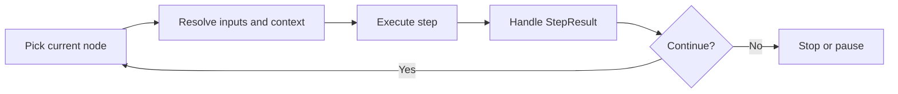

# Workflow Runner

`WorkflowRunner` is the runtime that executes a workflow.

It takes a `WorkflowDefinition`, moves through its nodes, executes each step, updates state, and decides what happens next.

Everything starts with:

```csharp
var runner = services.GetRequiredService<IWorkflowRunner>();
var result = await runner.RunAsync(workflow);
```

`IWorkflowRunner` is registered automatically by `AddSpectra`.

---

## What the runner does

At a high level, the runner repeats the same cycle until the workflow finishes or pauses:

1. choose the current node
2. resolve inputs from workflow state
3. execute the step
4. handle the step result
5. continue, pause, hand off, or stop



That is the core mental model.

---

## Basic execution flow

When you call `RunAsync`, the runner starts from the entry node or from a resume point if execution is continuing from a checkpoint.

For each node, it:

- resolves template expressions like `{{inputs.task}}`
- injects extra context such as agent IDs, session messages, or handoff payloads
- builds a `StepContext`
- calls `step.ExecuteAsync(...)`
- applies outputs to workflow state
- evaluates edges to find the next node
- checkpoints if checkpointing is enabled

The runner keeps doing this until the workflow:

- completes
- fails
- pauses for continuation
- pauses for user input
- pauses for an interrupt
- hands off to another agent

---

## Input resolution

Before a step runs, the runner prepares its inputs.

### Template values

`StateMapper` resolves expressions such as:

```text
{{inputs.task}}
{{nodes.fetch.output.data}}
```

using the current workflow state.

### Injected context

The runner can also inject runtime values automatically:

| Injected value | When it is used |
| --- | --- |
| `agentId` | The node is bound to an agent |
| prompt references | The node defines prompt refs and no explicit prompt overrides them |
| `userMessage` | A suspended session is resumed with `SendMessageAsync` |
| handoff payload | Execution arrives from another agent |
| `__subgraphId` | The node executes a subgraph |

This is what lets the same step model work across normal nodes, agents, sessions, and subgraphs.

---

## Step result handling

The runner does not decide what happened by inspecting the step's internals.

Instead, it reacts to the `StepResult` returned by the step.

| Status | What the runner does |
| --- | --- |
| `Succeeded` | Applies outputs, evaluates edges, continues |
| `Failed` | Records the error, checkpoints, stops |
| `NeedsContinuation` | Checkpoints, stops, resumes later at the same node |
| `Interrupted` | Checkpoints with pending interrupt, waits for `ResumeWithResponseAsync` |
| `AwaitingInput` | Checkpoints, waits for `SendMessageAsync` |
| `Handoff` | Resolves target agent node, injects handoff context, continues there |

This table is the key to understanding runner behavior.

---

## Handoff routing

When a step returns a handoff result, the runner switches execution to the target agent node.

In practice, it:

1. finds the node whose `AgentId` matches the handoff target
2. stores the handoff payload in workflow state
3. injects the transferred context into the target node
4. continues execution from that node

If the source agent requires approval for handoff, the runner pauses with an interrupt before routing.

See [Handoff Pattern](../multi-agent/handoff.md) for the full coordination model.

---

## Cycle detection

The runner tracks how many times each node is visited.

This matters for workflows with loops.

- if a node is revisited unexpectedly, the runner can detect a possible infinite loop
- if the workflow intentionally contains cycles, the runner enforces `MaxNodeIterations`

This prevents workflows from running forever because of bad routing or missing exit conditions.

---

## Checkpointing during execution

If checkpointing is configured, the runner saves workflow state as execution progresses.

This allows it to:

- resume after pauses
- support sessions
- recover from interrupts
- time-travel from earlier checkpoints
- fork execution from a prior point

You do not need to manage this manually during normal execution. The runner does it as part of its lifecycle.

See [Checkpointing](checkpointing.md) for the storage model and resume behavior.

---

## Runner methods

`IWorkflowRunner` supports more than just `RunAsync`.

| Method | Purpose | Details |
| --- | --- | --- |
| `RunAsync` | Start execution from the beginning | This page |
| `ResumeAsync` | Continue from the latest checkpoint | [Checkpointing](checkpointing.md) |
| `ResumeFromCheckpointAsync` | Continue from a specific checkpoint | [Time Travel](time-travel.md) |
| `ResumeWithResponseAsync` | Continue after an interrupt response | [Interrupts](interrupts.md) |
| `ForkAndRunAsync` | Branch execution from a checkpoint with modified state | [Time Travel](time-travel.md) |
| `SendMessageAsync` | Send a message into a suspended session | [Sessions](../concepts/sessions.md) |
| `StreamAsync` | Execute while streaming events in real time | [Streaming](streaming.md) |

A simple way to think about them:

- `RunAsync` starts
- `Resume*` continues
- `SendMessageAsync` talks to sessions
- `ForkAndRunAsync` explores alternative branches
- `StreamAsync` gives live execution output

---

## A practical mental model

The runner is the piece that turns a static workflow definition into a live execution.

- the **workflow** defines the graph
- the **steps** define the work
- the **runner** moves through the graph and manages execution state

If a step succeeds, the runner moves forward.

If a step pauses, the runner saves state and waits.

If a step hands off, the runner routes execution.

If a step fails, the runner stops.

That is the core behavior.

---

## What's next?

<div class="grid cards" markdown>

- **Checkpointing**

  Learn how workflow state is saved and restored.

  [:octicons-arrow-right-24: Checkpointing](checkpointing.md)

- **Interrupts**

  Pause execution for approval, human input, or external callbacks.

  [:octicons-arrow-right-24: Interrupts](interrupts.md)

- **Streaming**

  Consume workflow events while execution is happening.

  [:octicons-arrow-right-24: Streaming](streaming.md)

- **Time Travel**

  Resume or fork from earlier checkpoints.

  [:octicons-arrow-right-24: Time Travel](time-travel.md)

</div>