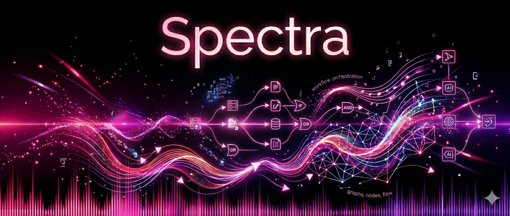

<div class="hero-banner" markdown>

<div class="hero-overlay" markdown>

# Spectra

**AI workflow orchestration for .NET.** Build workflows as explicit graphs in C# or JSON. Mix code and agent steps, swap providers per step, and keep every run visible.

[](https://opensource.org/licenses/MIT)
[](https://dotnet.microsoft.com/)
[](https://www.nuget.org/packages/Spectra)

[Get started](getting-started.md){ .md-button .md-button--primary }
[View on GitHub](https://github.com/alicank/Spectra){ .md-button }

</div>
</div>

---

<div class="grid cards" markdown>

-   :material-eye-outline:{ .lg .middle } __Workflows are visible__

    ---

    Every workflow is a graph you can read, debug, and change. Not buried in application code.

-   :material-puzzle-outline:{ .lg .middle } __Mix any kind of step__

    ---

    Code functions, LLM prompts, autonomous agents, human approval gates — all first-class nodes in the same graph.

-   :material-swap-horizontal:{ .lg .middle } __Swap providers freely__

    ---

    Route each step to OpenAI, Claude, Gemini, Ollama, or OpenRouter. Add fallback chains. The workflow definition doesn't change.

-   :material-shield-check-outline:{ .lg .middle } __Production resilient__

    ---

    Provider fallbacks, tool circuit breakers, response caching, checkpointing, and streaming out of the box.

</div>

---

## Get running in 60 seconds

```bash
dotnet new console -n MyWorkflow && cd MyWorkflow
dotnet add package Spectra
dotnet add package Spectra.Extensions
```

```csharp
using Microsoft.Extensions.DependencyInjection;
using Microsoft.Extensions.Hosting;
using Spectra.Contracts.Execution;
using Spectra.Contracts.State;
using Spectra.Registration;
using Spectra.Workflow;

var host = Host.CreateDefaultBuilder(args)
    .ConfigureServices(services =>
    {
        services.AddSpectra(spectra =>
        {
            spectra.AddOpenRouter(c =>
            {
                c.ApiKey = Environment.GetEnvironmentVariable("OPENROUTER_API_KEY")!;
                c.Model = "openai/gpt-4o-mini";
            });
            spectra.AddConsoleEvents();
        });
    })
    .Build();

var workflow = WorkflowBuilder.Create("hello")
    .AddAgent("assistant", "openrouter", "openai/gpt-4o-mini", a => a
        .WithSystemPrompt("You are a friendly assistant."))
    .AddAgentNode("greet", "assistant", n => n
        .WithUserPrompt("Say hello to {{inputs.name}} in a creative way.")
        .WithMaxIterations(1))
    .Build();

var runner = host.Services.GetRequiredService<IWorkflowRunner>();
var state = new WorkflowState();
state.Inputs["name"] = "World";
var result = await runner.RunAsync(workflow, state);
var output = (IDictionary<string, object?>)result.Context["greet"];
Console.WriteLine(output["response"]);
```

```bash
dotnet run
```

!!! tip "Using a different provider?"
    Replace `AddOpenRouter(...)` with `AddOpenAI(...)`, `AddAnthropic(...)`, `AddGemini(...)`, or `AddOllama(...)`. The workflow stays the same.

[**Full getting-started guide →**](getting-started.md)

---

## Chain steps together

The real power is connecting steps. Each node writes output to `Context` under its id, and later nodes reference it with `{{Context.greet.response}}` in prompt templates.
=== "C#"

    ```csharp
    var workflow = WorkflowBuilder.Create("greet-and-translate")
        .AddAgent("assistant", "openrouter", "openai/gpt-4o-mini", a => a
            .WithSystemPrompt("You are a helpful assistant."))
        .AddAgentNode("greet", "assistant", n => n
            .WithUserPrompt("Say hello to {{inputs.name}}.")
            .WithMaxIterations(1))
        .AddAgentNode("translate", "assistant", n => n
            .WithUserPrompt("Translate to French: {{nodes.greet.output}}")
            .WithMaxIterations(1))
        .AddEdge("greet", "translate")
        .Build();
    ```

=== "JSON"

    ```json
    {
      "id": "greet-and-translate",
      "nodes": [
        {
          "id": "greet",
          "stepType": "agent",
          "agentId": "assistant",
          "parameters": {
            "userPrompt": "Say hello to {{inputs.name}}.",
            "maxIterations": 1
          }
        },
        {
          "id": "translate",
          "stepType": "agent",
          "agentId": "assistant",
          "parameters": {
            "userPrompt": "Translate to French: {{nodes.greet.output}}",
            "maxIterations": 1
          }
        }
      ],
      "edges": [
        { "source": "greet", "target": "translate" }
      ],
      "agents": [
        {
          "id": "assistant",
          "provider": "openrouter",
          "model": "openai/gpt-4o-mini",
          "systemPrompt": "You are a helpful assistant."
        }
      ]
    }
    ```

=== "Provider Routing"

    Pick the right model for the step, and define fallbacks when needed.

    ```csharp
    var workflow = WorkflowBuilder.Create("resilient-agent")
        .AddAgentNode("draft-email", "writer", n => n
            .WithPrimaryModel("gpt-4o")
            .WithFallback("claude-3-5-sonnet")
            .WithFallback("llama-3-local"))
        .Build();
    ```

Nodes do work. Edges define flow. State moves through the graph. That's the whole model.

---

## What people build with it

<div class="grid" markdown>

!!! example "Agent pipelines"

    Autonomous tool-using agents with iteration limits and cost tracking.

!!! example "Retrieval workflows"

    Search → reason → validate with conditional branching.

!!! example "Multi-agent systems"

    Supervisor, handoff, and delegation patterns.

!!! example "Human-in-the-loop"

    Interrupt any step for approval, resume from checkpoint.

</div>

---

## Built on .NET

Spectra runs on the .NET runtime: parallel branches use real OS threads, state is compile-time typed, and `CancellationToken` flows through every step. `AddSpectra(...)` works like any other .NET service registration, and built-in OpenTelemetry tracing exports to your existing observability stack.

MIT licensed. Everything ships free — the engine, all built-in steps, every provider, checkpointing, streaming, multi-agent, and MCP support.

---

<div class="cta-footer" markdown>

**Ready to build?** Follow the step-by-step guide to create your first workflow.

[Getting Started :material-arrow-right:](getting-started.md){ .md-button .md-button--primary }
[GitHub](https://github.com/alicank/Spectra){ .md-button }
[NuGet](https://www.nuget.org/packages/Spectra){ .md-button }

</div>