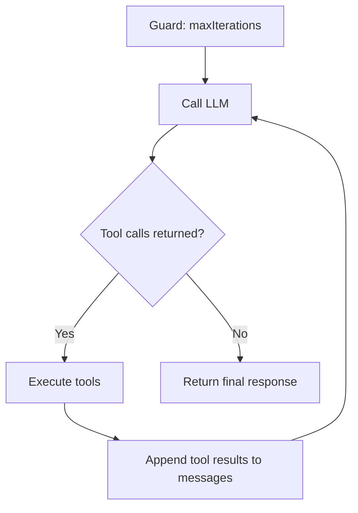

# Agent Step

Use `AgentStep` when a task needs more than one prompt→response.

Unlike `PromptStep`, `AgentStep` can:

- reason over multiple iterations
- call tools
- observe tool results
- continue until it reaches a final answer or a safety limit

**StepType:** `"agent"`

| Use case | Step |
| --- | --- |
| One-shot text generation | `PromptStep` |
| JSON output | `StructuredOutputStep` |
| Tool use and multi-turn reasoning | `AgentStep` |

---

## How it works



Each loop iteration is one LLM call.

If the model requests tools, Spectra executes them, adds the results to the conversation, and calls the model again.

The loop stops when:

- the model returns a final answer with no tool calls
- `maxIterations` is reached
- a handoff or escalation occurs

---

## Basic usage

```csharp
services.AddSpectra(builder =>
{
    builder.AddProvider<OpenAiCompatibleProvider>("openai", new OpenAiConfig
    {
        ApiKey = "sk-...",
        DefaultModel = "gpt-4o"
    });

    builder.AddAgent("researcher", agent => agent
        .WithProvider("openai")
        .WithSystemPrompt("You are a research assistant. Use tools to find answers.")
        .WithTools("web_search", "read_url"));
});

var workflow = Spectra.Workflow("research")
    .AddAgentStep("research", agent: "researcher", inputs: new
    {
        userPrompt = "{{inputs.question}}",
        maxIterations = 15
    })
    .Build();
```

This is the common pattern:

- register an agent
- give it tools
- run it with a task prompt

---

## When to use `AgentStep`

Use it when the model needs to **act**, not just answer.

Good fits:

- web research
- multi-step retrieval
- tool-driven analysis
- agent delegation
- workflows where the model must inspect results before continuing

Do not use it for simple one-shot tasks like summarization or rewriting. In those cases, `PromptStep` is simpler.

---

## Main inputs

| Input | Type | Default | Description |
| --- | --- | --- | --- |
| `agent` | `string` | — | Registered agent ID |
| `provider` | `string` | — | Provider name when `agent` is not set |
| `model` | `string` | `"unknown"` | Model identifier |
| `userPrompt` | `string` | — | Task for the agent |
| `userPromptRef` | `string` | — | Prompt registry reference |
| `systemPrompt` | `string` | — | Inline system prompt |
| `systemPromptRef` | `string` | — | Prompt registry reference for system prompt |
| `tools` | `List<string>` | — | Explicit tool whitelist |
| `maxIterations` | `int` | `10` | Max LLM calls before stopping |
| `tokenBudget` | `int` | `0` | Tracked cumulative token budget |
| `outputSchema` | `string` | — | JSON schema for final response validation |
| `temperature` | `double` | `0.7` | Sampling temperature |
| `maxTokens` | `int` | `2048` | Max tokens per LLM call |
| `messages` | `List<LlmMessage>` | — | Existing conversation for re-entry |

---

## Tool resolution

`AgentStep` builds its tool set from a few sources.

### Explicit tools

If `tools` is provided, Spectra resolves those tool names from `IToolRegistry`.

Unknown tool names fail immediately.

### Auto-injected tools

Depending on configuration, Spectra can also inject tools automatically:

- `transfer_to_agent` for handoffs
- `delegate_to_agent` for supervisors
- `recall_memory` and `store_memory` for memory-enabled agents

### Parallel execution

If the model returns multiple tool calls in one turn, Spectra executes them concurrently.

That means one iteration can gather multiple results without waiting for each call sequentially.

---

## Guard rails

`AgentStep` includes built-in limits to keep autonomous behavior bounded.

| Guard | Behavior |
| --- | --- |
| **Max iterations** | Stops after the configured number of LLM calls |
| **Token budget** | Tracks cumulative token use across iterations |
| **Output schema** | Validates the final response as JSON when configured |
| **Escalation** | Hands off when the agent cannot finish normally |

### Output schema

If `outputSchema` is set, the final response is parsed as JSON.

If parsing fails, the step returns a failed result.

This is useful when you want the final agent output to be machine-readable.

---

## Multi-agent handoffs

If the agent can hand work to another agent, Spectra injects a `transfer_to_agent` tool.

Before a handoff is accepted, Spectra validates:

1. the target is allowed
2. the target does not create a cycle
3. the handoff depth is within limits

If validation succeeds, the step returns a handoff result and the workflow routes to the target agent node.

If validation fails, the failure is returned to the model as a tool result.

### Conversation scope

When a handoff happens, the agent controls how much conversation is passed forward.

| Scope | What transfers |
| --- | --- |
| `Full` | Entire conversation |
| `LastN` | Only recent messages |
| `Summary` | Summarized conversation |
| `Handoff` | Only handoff intent and payload |

Example:

```csharp
builder.AddAgent("triage", agent => agent
    .WithProvider("openai")
    .WithSystemPrompt("Route customer issues to the right team.")
    .WithHandoffTargets("billing", "technical", "general")
    .WithConversationScope(ConversationScope.Full));
```

---

## Escalation

If an agent cannot finish, it can escalate instead of stopping silently.

```csharp
builder.AddAgent("analyst", agent => agent
    .WithProvider("openai")
    .WithEscalationTarget("senior-analyst"));
```

To pause for a human:

```csharp
builder.AddAgent("analyst", agent => agent
    .WithEscalationTarget("human"));
```

Using `"human"` causes the workflow to interrupt for review.

---

## Streaming

`AgentStep` streams only the **final response**.

Tool-calling turns use normal completion because the response must be fully parsed before tools can run.

---

## Events

`AgentStep` emits events for observability.

| Event | When |
| --- | --- |
| `AgentIterationEvent` | After an LLM call with tool calls |
| `AgentToolCallEvent` | After each tool execution |
| `AgentCompletedEvent` | When the agent finishes |
| `AgentHandoffEvent` | When a handoff is accepted |
| `AgentHandoffBlockedEvent` | When a handoff is rejected |
| `AgentEscalationEvent` | When escalation occurs |

Use these for logs, dashboards, tracing, and debugging.

---

## Outputs

| Output | Type | Description |
| --- | --- | --- |
| `response` | `string` | Final agent response |
| `messages` | `List<LlmMessage>` | Full conversation including tool calls and results |
| `iterations` | `int` | Number of LLM calls made |
| `totalInputTokens` | `int` | Total prompt tokens across iterations |
| `totalOutputTokens` | `int` | Total completion tokens across iterations |
| `model` | `string` | Model used |
| `stopReason` | `string` | Why the loop stopped |
| `parsedResponse` | `JsonElement?` | Parsed JSON when `outputSchema` is used |

In most workflows, the main outputs you consume are:

- `response`
- `messages`
- `iterations`

---

## Choosing between steps

| Scenario | Use |
| --- | --- |
| Simple one-shot prompt | `PromptStep` |
| Structured JSON output | `StructuredOutputStep` |
| Tool use with iterative reasoning | `AgentStep` |
| Multi-turn agent with handoffs or delegation | `AgentStep` |

---

## What's next?

<div class="grid cards" markdown>

- **Prompt & Structured Output**

  Use one-shot LLM calls for text or JSON output.

  [:octicons-arrow-right-24: Prompt Steps](prompt-steps.md)

- **Tools**

  Learn how tools are registered and exposed to agents.

  [:octicons-arrow-right-24: Tools Overview](../tools/overview.md)

- **Multi-Agent**

  Build handoff and supervisor patterns across several agents.

  [:octicons-arrow-right-24: Multi-Agent](../multi-agent/overview.md)

</div>