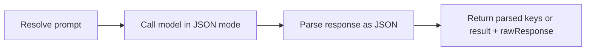

# Prompt & Structured Output Steps

Use these steps when you want to call an LLM directly inside a workflow.

- **`PromptStep`** for normal text output
- **`StructuredOutputStep`** for JSON output you want to consume downstream

| Need | Use |
| --- | --- |
| Generate text | `PromptStep` |
| Generate JSON | `StructuredOutputStep` |

---

## `PromptStep`

`PromptStep` performs one LLM call and returns the response.

**StepType:** `"prompt"`

Use it for:

- summarization
- translation
- rewriting
- drafting
- one-shot LLM tasks

### Basic usage

=== "Builder API"

    ```csharp
    var workflow = WorkflowBuilder.Create("summarize")
        .AddNode("summarize", "prompt", node => node
            .WithParameter("agentId", "openai")
            .WithParameter("userPrompt", "Summarize this in 3 bullets: {{inputs.text}}"))
        .Build();
    ```

=== "JSON Workflow"

    ```json
    {
      "nodes": [
        {
          "id": "summarize",
          "stepType": "prompt",
          "agentId": "openai",
          "inputs": {
            "userPrompt": "Summarize this in 3 bullets: {{inputs.text}}"
          }
        }
      ]
    }
    ```

### Common inputs

| Input | Type | Default | Description |
| --- | --- | --- | --- |
| `userPrompt` | `string` | — | Inline user prompt |
| `userPromptRef` | `string` | — | Prompt ID from the prompt registry |
| `systemPrompt` | `string` | — | Inline system prompt |
| `promptId` | `string` | — | Prompt registry ID used as fallback system prompt |
| `agentId` | `string` | — | Registered agent ID |
| `provider` | `string` | — | Provider name if no agent is used |
| `model` | `string` | `"unknown"` | Model ID |
| `temperature` | `double` | `0.7` | Sampling temperature |
| `maxTokens` | `int` | `2048` | Max response tokens |
| `images` | `list` | — | Images for multimodal requests |
| `messages` | `List<LlmMessage>` | — | Prebuilt messages; bypasses prompt resolution |
| `skipCache` | `bool` | `false` | Skip the LLM response cache |

### Prompt resolution

For `PromptStep`, Spectra resolves prompts in this order.

**User prompt**

1. `userPrompt`
2. `userPromptRef`
3. no user prompt

**System prompt**

1. `systemPrompt` input
2. agent's `SystemPromptRef` (from agent definition, resolved via prompt registry)
3. agent's `SystemPrompt` (from agent definition, inline)
4. `promptId` input (looked up in prompt registry)
5. no system prompt

All prompt templates support `{{...}}` expressions.

### Multimodal input

If the model supports vision, you can send images with the prompt:

```csharp
var workflow = WorkflowBuilder.Create("describe-image")
    .AddNode("describe", "prompt", node => node
        .WithParameter("agentId", "openai")
        .WithParameter("userPrompt", "Describe what you see in this image.")
        .WithParameter("images", new[]
        {
            new { data = base64ImageData, mimeType = "image/png" }
        }))
    .Build();
```

### Streaming

When the workflow runs in streaming mode, `PromptStep` automatically streams tokens if the client supports it.

!!! note
    Streaming is only used for token delivery during execution. The final full response is still captured in the step outputs.

### Outputs

| Output | Type | Description |
| --- | --- | --- |
| `response` | `string` | Full LLM response |
| `model` | `string` | Model actually used |
| `inputTokens` | `int?` | Prompt token count |
| `outputTokens` | `int?` | Completion token count |
| `latency` | `TimeSpan?` | LLM round-trip time |
| `stopReason` | `string?` | Why generation stopped |
| `toolCalls` | `List<ToolCall>?` | Tool calls requested by the model |

In most workflows, the main value you use downstream is the response text.

---

## `StructuredOutputStep`

`StructuredOutputStep` is for cases where you want structured JSON instead of plain text.

**StepType:** `"structured_output"`

Use it for:

- extraction
- classification
- records or objects
- downstream machine-readable outputs

### Basic usage

```csharp
var workflow = WorkflowBuilder.Create("extract-entities")
    .AddNode("extract", "structured_output", node => node
        .WithParameter("agentId", "openai")
        .WithParameter("userPrompt", "Extract all people and places from: {{inputs.text}}")
        .WithParameter("jsonSchema", """
            {
                "type": "object",
                "properties": {
                    "people": { "type": "array", "items": { "type": "string" } },
                    "places": { "type": "array", "items": { "type": "string" } }
                }
            }
            """))
    .Build();
```

### How it works



If `jsonSchema` is provided, Spectra uses structured JSON mode when the provider supports it.

If no schema is provided, it requests general JSON output.

If the response is not valid JSON, the step fails with the parse error and keeps the raw response.

### Outputs

Output shape depends on what the LLM returns:

| Case | Outputs |
| --- | --- |
| JSON object | The parsed key-value pairs become outputs directly (e.g. `nodes.extract.output.people`) |
| JSON array or primitive | `result` (the parsed value) + `rawResponse` (original string) |
| Invalid JSON | Fails with error; `rawResponse` preserved in output |

### Consuming structured output downstream

```csharp
var workflow = WorkflowBuilder.Create("extract-and-process")
    .AddNode("extract", "structured_output", node => node
        .WithParameter("agentId", "openai")
        .WithParameter("userPrompt", "Extract all people and places from: {{inputs.text}}"))
    .AddNode("process", "prompt", node => node
        .WithParameter("agentId", "openai")
        .WithParameter("userPrompt", "Write bios for: {{nodes.extract.output.people}}"))
    .AddEdge("extract", "process")
    .Build();
```

!!! warning "Schema support varies by provider"
    Not every provider supports native structured output. When native schema mode is unavailable, Spectra falls back to JSON-oriented prompting. You should still validate important outputs.

---

## Choosing between them

| Scenario | Use |
| --- | --- |
| Free-form text generation | `PromptStep` |
| Need JSON output for downstream logic | `StructuredOutputStep` |
| Have a schema and want structured JSON | `StructuredOutputStep` with `jsonSchema` |
| Need JSON but no fixed schema | `StructuredOutputStep` without `jsonSchema` |
| Need tool calling | `PromptStep` or `AgentStep` |

---

## What's next?

<div class="grid cards" markdown>

- **Prompts**

  Reuse prompt files and prompt references.

  [:octicons-arrow-right-24: Prompt Management](prompts.md)

- **Providers**

  Connect steps to OpenAI, Anthropic, Gemini, Ollama, OpenRouter, or compatible APIs.

  [:octicons-arrow-right-24: Providers](providers.md)

- **Agent Step**

  Use multi-turn agents with tools, loops, and handoffs.

  [:octicons-arrow-right-24: Agent Step](agent-step.md)

</div>