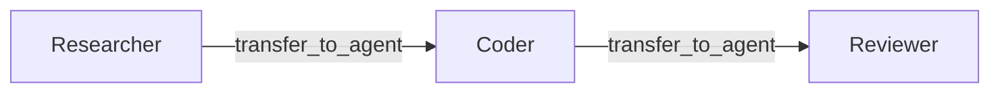

# Handoff Pattern

A **handoff** is a one-way transfer of control between agents.

The current agent stops, and the target agent takes over.

The original agent does **not** get control back.



Use handoff when work naturally moves from one specialist to the next.

Examples:

- triage → billing
- researcher → coder
- coder → reviewer

---

## How it works

A handoff follows this flow:

1. the agent declares allowed handoff targets
2. Spectra injects a `transfer_to_agent` tool
3. the LLM calls that tool during its loop
4. Spectra intercepts the call and validates it
5. if valid, the workflow routes to the target agent
6. if invalid, the error is returned to the LLM as a tool result

The tool is intercepted internally. You do not implement it yourself.

---

## Basic configuration

```csharp
var workflow = WorkflowBuilder.Create("support-pipeline")
    .AddAgent("triage", "openai", "gpt-4o", agent => agent
        .WithSystemPrompt("Route customer issues to the right team.")
        .WithHandoffTargets("billing", "technical", "general")
        .WithHandoffPolicy(HandoffPolicy.Allowed)
        .WithConversationScope(ConversationScope.Full))

    .AddAgent("billing", "openai", "gpt-4o", agent => agent
        .WithSystemPrompt("You handle billing questions.")
        .WithConversationScope(ConversationScope.Full))

    .AddAgent("technical", "anthropic", "claude-sonnet-4-20250514", agent => agent
        .WithSystemPrompt("You handle technical support.")
        .WithEscalationTarget("human"))

    .AddAgentNode("triage-node", "triage", node => node
        .WithUserPrompt("{{inputs.message}}")
        .WithMaxIterations(5))

    .AddAgentNode("billing-node", "billing", node => node
        .WithMaxIterations(10))

    .AddAgentNode("technical-node", "technical", node => node
        .WithTools("read_docs", "search_kb")
        .WithMaxIterations(15))

    .SetEntryNode("triage-node")
    .Build();
```

In this example:

- `triage` can hand off to `billing`, `technical`, or `general`
- the target agent becomes the active agent for the rest of that path
- `technical` can escalate to a human if needed

---

## The `transfer_to_agent` tool

Spectra injects this tool automatically when handoffs are allowed.

You do not register it manually.

| Parameter | Type | Required | Description |
| --- | --- | --- | --- |
| `target_agent` | `string` | Yes | Agent to transfer to |
| `intent` | `string` | Yes | Why the handoff is happening |
| `context` | `string` | No | Extra instructions or structured data |
| `constraints` | `string` | No | Constraints the next agent should follow |

The tool description includes the allowed target names so the model knows which agents it can transfer to.

---

## Conversation scope

When a handoff happens, you control how much conversation history the next agent receives.

```csharp
agent.WithConversationScope(ConversationScope.Full)
// or
agent.WithConversationScope(ConversationScope.LastN, maxMessages: 5)
```

| Scope | Effect |
| --- | --- |
| `Handoff` | Only the handoff payload is passed |
| `Full` | Entire conversation is forwarded |
| `LastN` | Only the most recent messages are forwarded |
| `Summary` | Summarized transfer *(not yet implemented)* |

`Handoff` is the cleanest default.

Use `Full` or `LastN` when the next agent needs more conversational context.

---

## Approval gates

For sensitive transfers, require approval before the handoff executes.

```csharp
agent.WithHandoffPolicy(HandoffPolicy.RequiresApproval)
```

In this mode, a handoff request triggers an [interrupt](../execution/interrupts.md) and waits for human approval.

---

## Validation

Every handoff is validated before routing.

| Check | What is validated | On failure |
| --- | --- | --- |
| **Target allowed** | The target is in `HandoffTargets` | Error returned to the LLM |
| **Cycle detection** | The target has not already appeared in the chain | Handoff blocked |
| **Depth limit** | The chain is within the configured maximum depth | Handoff blocked |

When a handoff is blocked, Spectra feeds the error back as a tool result and the agent must continue handling the task itself.

---

## Handoff chains

Handoffs can form chains such as:

- researcher → coder
- coder → reviewer

```csharp
.AddAgent("researcher", ..., agent => agent
    .WithHandoffTargets("coder"))

.AddAgent("coder", ..., agent => agent
    .WithHandoffTargets("reviewer"))

.AddAgent("reviewer", ..., agent => agent
    .WithConversationScope(ConversationScope.Full))
```

You can control the maximum chain depth at the workflow level:

```csharp
WorkflowBuilder.Create("pipeline")
    .WithMaxHandoffChainDepth(5)
```

This prevents runaway routing across too many agents.

---

## A simple mental model

A handoff means:

- the current agent decides it is no longer the best agent
- it transfers the task
- the next agent continues from there

There is no return path to the original agent.

If you want a result to come back to the caller, use the [Supervisor pattern](supervisor.md) instead.

---

## What's next?

<div class="grid cards" markdown>

- **Supervisor Pattern**

  Delegate work to a worker and get the result back.

  [:octicons-arrow-right-24: Supervisor](supervisor.md)

- **Guard Rails**

  Configure cycle checks, depth limits, and coordination safety.

  [:octicons-arrow-right-24: Guard Rails](guard-rails.md)

</div>