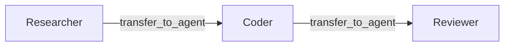
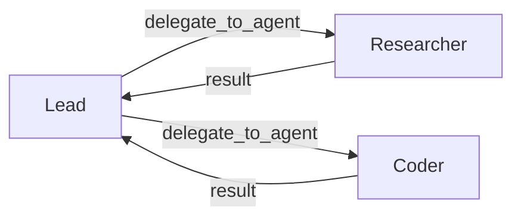

# Multi-Agent Overview

Spectra supports workflows where multiple agents collaborate on the same task.

There are two coordination patterns:

- **handoff** — one agent transfers control to another
- **delegation** — one agent sends a subtask to a worker and keeps control

Both patterns are tool-based. The model decides when to coordinate by calling built-in tools that Spectra injects automatically.

---

## Choose the pattern

| Pattern | What happens | Best for |
| --- | --- | --- |
| **Handoff** | One agent takes over from another | Specialist-to-specialist transitions |
| **Delegation** | A supervisor assigns work and receives the result back | Task decomposition and aggregation |

---

## Handoff

In a handoff, control moves from one agent to another.

The first agent stops. The next agent continues the task.



Use handoff when work naturally moves between specialists.

Examples:

- research → coding
- triage → billing
- intake → support
- planner → executor

[Handoff Pattern →](handoff.md)

---

## Delegation

In delegation, a supervisor sends a subtask to a worker and gets the result back.

The supervisor stays in control.



Use delegation when one agent needs to break work into parts and combine the results.

Examples:

- planner assigns research and implementation
- reviewer asks a worker to extract details
- coordinator distributes subtasks to specialists

[Supervisor Pattern →](supervisor.md)

---

## Agent configuration

Multi-agent behavior is configured on the agent definition.

```csharp
builder.AddAgent("triage", "openai", "gpt-4o", agent => agent
    .WithSystemPrompt("Route customer issues to the right team.")

    // Handoff
    .WithHandoffTargets("billing", "technical", "general")
    .WithHandoffPolicy(HandoffPolicy.Allowed)
    .WithConversationScope(ConversationScope.Full)

    // Delegation
    .AsSupervisor("researcher", "coder")
    .WithDelegationPolicy(DelegationPolicy.Allowed)
    .WithMaxDelegationDepth(2)

    // Safety
    .WithCyclePolicy(CyclePolicy.Deny)
    .WithEscalationTarget("human")
    .WithTimeout(TimeSpan.FromMinutes(5)));
```

You usually only configure the parts you need. Not every multi-agent workflow needs both handoff and delegation.

---

## Policies

These policies control whether an agent is allowed to coordinate.

| Policy | Values | Description |
| --- | --- | --- |
| `HandoffPolicy` | `Allowed`, `RequiresApproval`, `Disabled` | Controls whether the agent can transfer work |
| `DelegationPolicy` | `Allowed`, `RequiresApproval`, `Disabled` | Controls whether the supervisor can delegate work |

When set to `RequiresApproval`, Spectra pauses for human approval before continuing.

See [Interrupts](../execution/interrupts.md).

---

## Conversation scope

When a handoff happens, the agent can control how much conversation history is passed to the next agent.

| Scope | What transfers |
| --- | --- |
| `Handoff` | Only the handoff payload. Cleanest default |
| `Full` | Entire conversation history |
| `LastN` | Only the most recent messages |
| `Summary` | Summarized conversation *(not yet implemented)* |

Use a smaller scope when you want cleaner separation between agents. Use a larger scope when the next agent needs more context.

---

## Escalation

If an agent cannot finish, it can escalate.

```csharp
agent.WithEscalationTarget("senior-analyst")
agent.WithEscalationTarget("human")
```

Use another agent when you want a stronger or more specialized fallback.

Use `"human"` when the workflow should pause for manual review.

---

## Events

Multi-agent coordination emits events for observability.

| Event | When |
| --- | --- |
| `AgentHandoffEvent` | A handoff is accepted |
| `AgentHandoffBlockedEvent` | A handoff is rejected |
| `AgentEscalationEvent` | An agent escalates |
| `AgentDelegationStartedEvent` | A supervisor starts delegated work |
| `AgentDelegationCompletedEvent` | A worker returns its result |

These events are useful for logs, tracing, dashboards, and debugging coordination behavior.

---

## A simple mental model

- **Handoff** = "you take over"
- **Delegation** = "do this and report back"

That is the core distinction.

---

## What's next?

<div class="grid cards" markdown>

- **Handoff Pattern**

  Transfer control from one agent to another.

  [:octicons-arrow-right-24: Handoffs](handoff.md)

- **Supervisor Pattern**

  Delegate subtasks to workers and continue with the results.

  [:octicons-arrow-right-24: Supervisor](supervisor.md)

- **Guard Rails**

  Control cycles, depth, escalation, and coordination limits.

  [:octicons-arrow-right-24: Guard Rails](guard-rails.md)

</div>