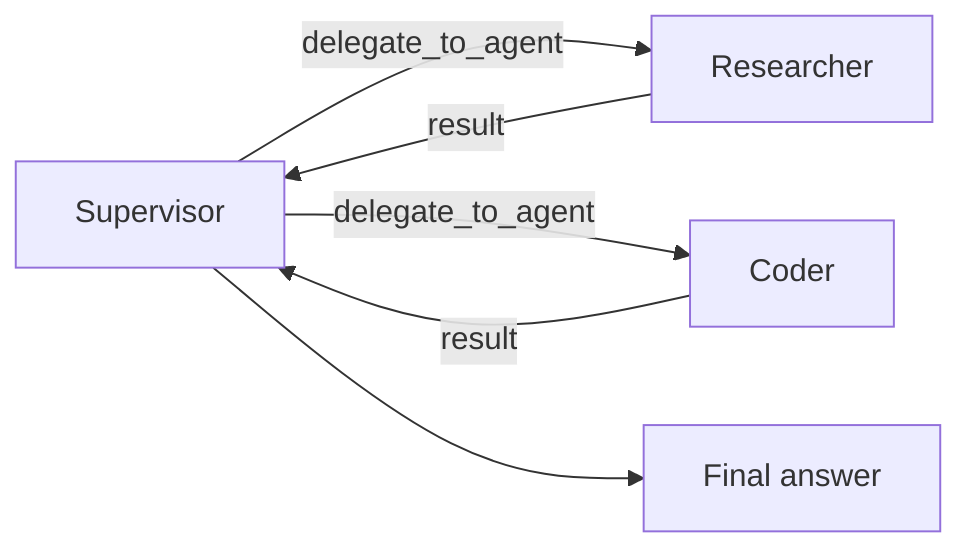

# Supervisor Pattern

A **supervisor** is an agent that delegates subtasks to worker agents and gets the results back.

Unlike a handoff, the supervisor keeps control.

It can:

- delegate work
- inspect the results
- delegate again
- produce the final answer



Use this pattern when one agent needs to break a task into parts and combine the outputs.

Examples:

- research + implementation + synthesis
- analysis + validation + summary
- planner coordinating several specialists

---

## How it works

A supervisor flow looks like this:

1. the agent declares its workers
2. Spectra injects a `delegate_to_agent` tool
3. the LLM calls that tool with a worker and a task
4. Spectra runs the worker inline as a nested agent execution
5. the worker result is returned to the supervisor as a tool result
6. the supervisor continues reasoning

Unlike `transfer_to_agent`, delegation is a real tool execution.

The supervisor keeps control throughout the step.

---

## Basic configuration

```csharp
var workflow = WorkflowBuilder.Create("supervised-team")
    .WithGlobalTokenBudget(500_000)
    .WithMaxTotalAgentIterations(200)

    .AddAgent("lead", "openai", "gpt-4o", agent => agent
        .WithSystemPrompt(
            "You are a team lead. Break down the task and delegate to your workers. " +
            "Collect their results and synthesize a final answer.")
        .AsSupervisor("researcher", "coder", "analyst")
        .WithDelegationPolicy(DelegationPolicy.Allowed)
        .WithMaxDelegationDepth(2)
        .WithEscalationTarget("human"))

    .AddAgent("researcher", "openai", "gpt-4o", agent => agent
        .WithSystemPrompt("You are a research specialist."))

    .AddAgent("coder", "anthropic", "claude-sonnet-4-20250514", agent => agent
        .WithSystemPrompt("You are a coding specialist."))

    .AddAgent("analyst", "openai", "gpt-4o", agent => agent
        .WithSystemPrompt("You are a data analyst."))

    .AddAgentNode("lead-node", "lead", node => node
        .WithUserPrompt("{{inputs.task}}")
        .WithMaxIterations(30)
        .WithTokenBudget(100_000)
        .WithTimeout(TimeSpan.FromMinutes(10)))

    .SetEntryNode("lead-node")
    .Build();
```

In this example:

- `lead` is the supervisor
- `researcher`, `coder`, and `analyst` are allowed workers
- the supervisor can delegate within depth and budget limits
- the final answer still comes from `lead`

---

## The `delegate_to_agent` tool

Spectra injects this tool automatically when an agent is configured as a supervisor.

You do not register it manually.

| Parameter | Type | Required | Description |
| --- | --- | --- | --- |
| `worker_agent` | `string` | Yes | Worker to delegate to |
| `task` | `string` | Yes | Task description for the worker |
| `constraints` | `string` | No | Constraints the worker should respect |

The tool description includes the available worker names so the model knows what it can choose from.

---

## Worker execution

When the supervisor delegates, Spectra:

1. validates the target worker
2. checks depth and budget limits
3. resolves the worker agent definition
4. runs a child `AgentStep` inline
5. returns the worker's response as the tool result

Each worker uses its own agent configuration, tools, and limits.

To avoid runaway recursion, worker execution excludes supervisor-style coordination tools such as `delegate_to_agent` and `transfer_to_agent` unless your runtime explicitly allows them.

---

## Delegation limits

Supervisors need boundaries, especially when they can spawn nested work.

### Delegation depth

Use `WithMaxDelegationDepth(...)` to limit how deep nested delegations can go.

```csharp
.WithMaxDelegationDepth(2)
```

This prevents unbounded recursive delegation.

### Global token budget

You can also set a workflow-level budget:

```csharp
.WithGlobalTokenBudget(500_000)
```

Worker token usage contributes to the shared execution budget.

If the budget is exhausted, further delegations are blocked.

### Total iteration limits

You can cap total agent activity across the workflow:

```csharp
.WithMaxTotalAgentIterations(200)
```

This helps prevent excessive nested execution.

---

## Delegation events

Spectra emits events for delegation activity.

| Event | When |
| --- | --- |
| `AgentDelegationStartedEvent` | A supervisor starts delegated work |
| `AgentDelegationCompletedEvent` | A worker returns its result |

These are useful for observability, tracing, and debugging multi-agent behavior.

---

## Supervisor vs handoff

| Aspect | Handoff | Supervisor |
| --- | --- | --- |
| Control flow | Original agent stops | Supervisor continues |
| Tool | `transfer_to_agent` | `delegate_to_agent` |
| Execution style | Routed transfer | Nested inline execution |
| Best for | Specialist transitions | Task decomposition |
| Result path | No return to caller | Result returns to supervisor |

A simple mental model:

- **handoff** = "you take over"
- **supervisor** = "do this and report back"

---

## When to use this pattern

Use the supervisor pattern when:

- one agent should coordinate several specialists
- subtasks should return to a central decision-maker
- the final answer should come from a single orchestrating agent
- work needs decomposition, aggregation, or comparison

Do not use it when the task should permanently move to another specialist. That is a handoff.

---

## What's next?

<div class="grid cards" markdown>

- **Handoff Pattern**

  Transfer control from one agent to another.

  [:octicons-arrow-right-24: Handoffs](handoff.md)

- **Guard Rails**

  Configure safety limits for depth, cycles, and coordination behavior.

  [:octicons-arrow-right-24: Guard Rails](guard-rails.md)

</div>