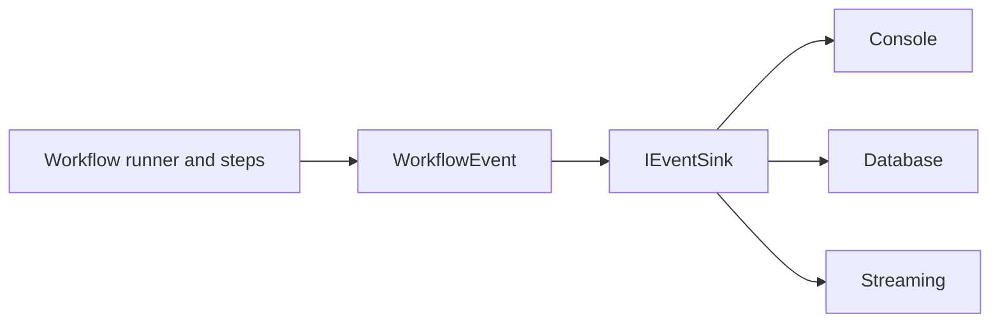

# Events & Sinks

Every important action in a Spectra workflow emits a structured event.

Events are how you:

- observe workflow execution
- log what happened
- debug failures
- power live UIs
- build audit and tracing pipelines

A simple distinction:

- an **event** is **what happened**
- a **sink** is **where it goes**

---

## How events flow



You can register multiple sinks at the same time.

That means the same event can be sent to:

- the console for development
- a database for audit or analytics
- a streaming consumer for real-time UI updates

---

## Common use cases

Use events when you want to:

- see which node is running
- inspect step outputs and failures
- track state changes
- observe agent tool calls
- monitor handoffs and delegation
- stream token output
- build dashboards or alerts

---

## Built-in sinks

### Console sink

Use the console sink during development:

```csharp
builder.AddConsoleEvents();
```

This writes each event as a structured line to stdout.

### Composite sink

If you register more than one sink, Spectra automatically fans events out to all of them.

```csharp
builder.AddConsoleEvents();
builder.AddEventSink(new DatabaseSink(db));
```

Both sinks receive every event.

### Streaming sink

`StreamingEventSink` powers `runner.StreamAsync(...)`.

You do not register it manually. The runner creates it internally when streaming is used.

See [Streaming](../execution/streaming.md).

### Null sink

If no sink is registered, Spectra uses a no-op sink internally.

This keeps the execution pipeline simple without requiring null checks everywhere.

---

## Event catalog

Spectra emits events across several categories.

### Workflow lifecycle

| Event | Fired when | Key data |
| --- | --- | --- |
| `WorkflowStartedEvent` | A run begins | Workflow name, node count |
| `WorkflowCompletedEvent` | A run finishes | Success, duration, step count, errors |
| `WorkflowResumedEvent` | A run resumes | Resume node, completed step count |
| `WorkflowForkedEvent` | A run is forked | Source run ID, checkpoint index |

### Step execution

| Event | Fired when | Key data |
| --- | --- | --- |
| `StepStartedEvent` | A step begins | Step type, resolved inputs |
| `StepCompletedEvent` | A step finishes | Status, duration, outputs, error |
| `StepInterruptedEvent` | A step is interrupted | Reason, title, interrupt mode |

### State and branching

| Event | Fired when | Key data |
| --- | --- | --- |
| `StateChangedEvent` | Workflow state changes | Section, key, new value |
| `BranchEvaluatedEvent` | An edge condition is evaluated | From node, to node, condition, result |

### Parallel execution

| Event | Fired when | Key data |
| --- | --- | --- |
| `ParallelBatchStartedEvent` | A parallel batch starts | Node IDs, batch size |
| `ParallelBatchCompletedEvent` | A parallel batch finishes | Node IDs, success count, failure count, duration |

### Agent loop

| Event | Fired when | Key data |
| --- | --- | --- |
| `AgentIterationEvent` | An LLM call returns tool calls | Iteration, tool names, tokens |
| `AgentToolCallEvent` | A tool executes | Tool name, args, success or error, duration |
| `AgentCompletedEvent` | The agent loop ends | Iterations, tokens, stop reason |

### Multi-agent coordination

| Event | Fired when | Key data |
| --- | --- | --- |
| `AgentHandoffEvent` | A handoff is accepted | From agent, to agent, intent, depth |
| `AgentHandoffBlockedEvent` | A handoff is rejected | From agent, to agent, reason |
| `AgentEscalationEvent` | An agent escalates | Failed agent, target, reason |
| `AgentDelegationStartedEvent` | A supervisor starts worker execution | Supervisor, worker, task, depth |
| `AgentDelegationCompletedEvent` | A worker returns | Status, tokens, duration |

### Sessions

| Event | Fired when | Key data |
| --- | --- | --- |
| `SessionTurnCompletedEvent` | A conversation turn finishes | Turn number, response, tokens, tool calls |
| `SessionAwaitingInputEvent` | A session pauses for user input | Completed turns, total tokens |
| `SessionCompletedEvent` | A session ends | Total turns, exit reason |

### Resilience

| Event | Fired when | Key data |
| --- | --- | --- |
| `FallbackTriggeredEvent` | Provider fallback moves to the next candidate | Failed provider, next provider, strategy |
| `QualityGateRejectedEvent` | A response fails a quality gate | Provider, model, rejection reason |
| `FallbackExhaustedEvent` | All fallback candidates fail | Attempt count, last error |

### Tool resilience

| Event | Fired when | Key data |
| --- | --- | --- |
| `ToolCircuitStateChangedEvent` | A tool circuit breaker changes state | Tool name, previous state, new state, failures |
| `ToolCallSkippedEvent` | A tool call is skipped by an open circuit | Tool name, circuit state, fallback tool |

### MCP

| Event | Fired when | Key data |
| --- | --- | --- |
| `McpServerConnectedEvent` | An MCP server connects and tools are discovered | Server name, transport, tool count, tool names |
| `McpServerDisconnectedEvent` | An MCP server disconnects | Server name, reason |
| `McpToolCallEvent` | An MCP tool is invoked | Server, tool, transport, duration, success, retry count |
| `McpToolCallBlockedEvent` | An MCP tool call is blocked by a guardrail | Server, tool, reason |

### Streaming

| Event | Fired when | Key data |
| --- | --- | --- |
| `TokenStreamEvent` | A token chunk is emitted | Token text, token index, completion flag |

---

## Write a custom sink

To send events somewhere else, implement `IEventSink`.

```csharp
public class DatabaseSink : IEventSink
{
    private readonly IDbConnection _db;

    public DatabaseSink(IDbConnection db) => _db = db;

    public async Task PublishAsync(WorkflowEvent evt, CancellationToken ct = default)
    {
        await _db.ExecuteAsync(
            "INSERT INTO events (event_id, run_id, type, timestamp, data) VALUES (@Id, @Run, @Type, @Time, @Data)",
            new
            {
                Id = evt.EventId,
                Run = evt.RunId,
                Type = evt.EventType,
                Time = evt.Timestamp,
                Data = JsonSerializer.Serialize<object>(evt)
            });
    }
}
```

Register it like this:

```csharp
builder.AddEventSink(new DatabaseSink(connection));
```

---

## What every event includes

All workflow events inherit common base fields such as:

- `EventId`
- `RunId`
- `WorkflowId`
- `NodeId`
- `Timestamp`
- `EventType`
- `TenantId`
- `UserId`

That makes it easier to:

- correlate logs
- group events by run
- trace a node's behavior
- persist events in your own store

---

## A simple mental model

Think of Spectra events like a structured execution journal.

- steps and agents produce the journal entries
- sinks decide where the entries are written

That is the whole model.

---

## What's next?

<div class="grid cards" markdown>

- **OpenTelemetry**

  Export workflow execution into tracing systems.

  [:octicons-arrow-right-24: OpenTelemetry](opentelemetry.md)

- **Audit Trail**

  Store workflow activity for compliance and review.

  [:octicons-arrow-right-24: Audit Trail](audit.md)

- **Streaming**

  Consume workflow events live as they happen.

  [:octicons-arrow-right-24: Streaming](../execution/streaming.md)

</div>
