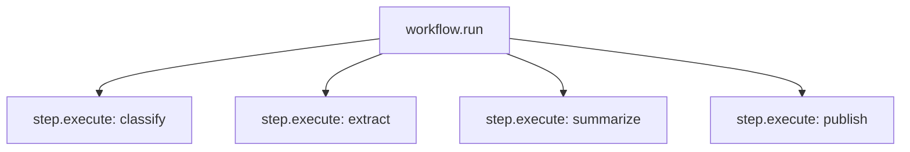
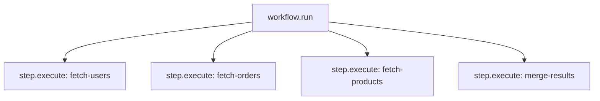

# OpenTelemetry

Spectra emits OpenTelemetry tracing spans for workflow execution.

If your .NET application already uses OpenTelemetry, Spectra traces can appear alongside:

- HTTP requests
- database calls
- message handlers
- background jobs

In most cases, you only need to add Spectra's `ActivitySource`.

---

## What you get

Spectra creates spans for:

- the overall workflow run
- each step execution

That gives you a trace shape like this:



This makes it easy to see:

- how long the workflow took
- which steps were slow
- where failures happened
- which branch became the bottleneck

---

## Setup

Add Spectra's activity source to your OpenTelemetry tracing configuration:

```csharp
builder.Services.AddOpenTelemetry()
    .WithTracing(tracing => tracing
        .AddSource(SpectraActivitySource.SourceName)
        .AddConsoleExporter()
    );
```

That is usually enough to start seeing Spectra traces.

---

## Span tags

Spectra attaches structured tags to its spans.

| Tag | Example value |
| --- | --- |
| `spectra.workflow.id` | `"data-pipeline"` |
| `spectra.run.id` | `"run-abc-123"` |
| `spectra.node.id` | `"summarize"` |
| `spectra.step.type` | `"agent"` |
| `spectra.step.status` | `"Succeeded"` |
| `spectra.interrupt.reason` | `"Approval required"` |

These tags make it easier to filter and analyze workflow traces in your observability platform.

---

## Failures

When a step fails, Spectra records the failure on the span.

That includes the error details needed to understand:

- which step failed
- why it failed
- where it failed in the run

This makes trace views useful not just for latency analysis, but also for debugging.

---

## Parallel execution

Parallel steps appear as separate child spans under the same workflow run.



This helps you quickly see which parallel branch took the longest.

That is especially useful for:

- fan-out workflows
- parallel retrieval
- concurrent enrichment
- multi-branch processing

---

## Exporters

Spectra works with normal OpenTelemetry exporters.

### Console

```csharp
tracing.AddConsoleExporter();
```

### Azure Application Insights

```csharp
tracing.AddAzureMonitorTraceExporter(opts =>
{
    opts.ConnectionString = "InstrumentationKey=...";
});
```

### Jaeger

```csharp
tracing.AddJaegerExporter(opts =>
{
    opts.AgentHost = "localhost";
    opts.AgentPort = 6831;
});
```

### OTLP

```csharp
tracing.AddOtlpExporter(opts =>
{
    opts.Endpoint = new Uri("http://localhost:4317");
});
```

Use whichever exporter already fits the rest of your observability stack.

---

## Correlating traces with events

Spectra traces and Spectra events share the same run and node identifiers.

That means you can combine:

- **traces** for timing and execution structure
- **events** for workflow-level business details

This is useful when you want to answer questions like:

- which step was slowest?
- which agent iteration failed?
- what workflow path produced this result?
- what happened in the run around this span?

See [Events & Sinks](events.md).

---

## A simple mental model

OpenTelemetry gives you the **performance view** of a workflow.

- events tell you **what happened**
- traces tell you **where time went**

That is the role of Spectra's tracing support.

---

## What's next?

<div class="grid cards" markdown>

- **Events & Sinks**

  Observe workflow activity with structured events.

  [:octicons-arrow-right-24: Events](events.md)

- **Audit Trail**

  Store workflow activity for compliance and review.

  [:octicons-arrow-right-24: Audit Trail](audit.md)

</div>