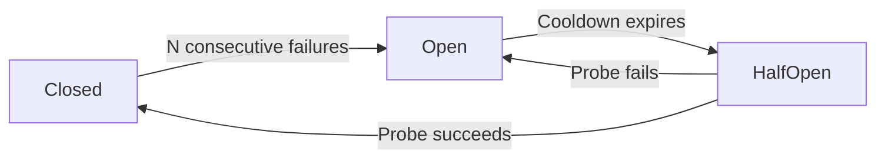

# Tool Resilience

Tools can fail repeatedly.

That might mean:

- an MCP server is down
- an external API is rate-limiting
- a network dependency is unstable
- a tool endpoint is timing out

Spectra can wrap tools with a **circuit breaker** so unhealthy tools stop being called for a while instead of failing over and over.

!!! note
    This page is about resilience for **tool execution**. For resilience on **LLM calls**, see [Retry & Timeout](../resilience/retry.md) and [Provider Fallback](../resilience/fallback.md).

---

## Enable tool resilience

```csharp
services.AddSpectra(builder =>
{
    builder.AddToolResilience(opts =>
    {
        opts.FailureThreshold = 3;
        opts.CooldownPeriod = TimeSpan.FromSeconds(30);
    });
});
```

When enabled, Spectra wraps each registered tool with a resilience decorator that tracks failures and manages circuit state.

---

## How the circuit breaker works



### States

| State | Behavior |
| --- | --- |
| `Closed` | Normal operation. Tool calls run normally |
| `Open` | Calls are rejected immediately without executing the tool |
| `HalfOpen` | A small number of probe calls are allowed to test recovery |

A simple mental model:

- **Closed** = healthy
- **Open** = stop calling it
- **HalfOpen** = test whether it recovered

---

## Configuration

```csharp
builder.AddToolResilience(opts =>
{
    opts.FailureThreshold = 5;
    opts.CooldownPeriod = TimeSpan.FromSeconds(60);
    opts.HalfOpenMaxAttempts = 1;
    opts.SuccessThresholdToClose = 1;
});
```

### Options

| Option | Default | Description |
| --- | --- | --- |
| `FailureThreshold` | `5` | Consecutive failures before opening the circuit |
| `CooldownPeriod` | `60s` | How long the circuit stays open before probing again |
| `HalfOpenMaxAttempts` | `1` | Number of probe calls allowed in half-open state |
| `SuccessThresholdToClose` | `1` | Successful probe calls required to close the circuit |

---

## Fallback tools

You can also map one tool to another fallback tool.

```csharp
builder.AddToolResilience(opts =>
{
    opts.FailureThreshold = 3;
    opts.FallbackTools["mcp:weather-api:get_forecast"] = "mcp:backup-weather:get_forecast";
    opts.FallbackTools["external_search"] = "local_search";
});
```

When the primary tool's circuit is open, Spectra routes the call to the fallback tool instead.

This is useful when you have:

- a backup MCP server
- a local replacement for a remote API
- a degraded but still usable alternative

The agent does not need to change how it calls the tool.

---

## What happens during failure

With tool resilience enabled, the normal flow is:

1. the tool fails repeatedly
2. the circuit opens after the configured threshold
3. future calls are rejected immediately
4. after the cooldown, Spectra allows probe calls
5. if the tool recovers, the circuit closes
6. if not, it opens again

If a fallback tool is configured, Spectra can route to that tool when the primary is open.

---

## Events

Circuit state changes emit events through `IEventSink`.

Use these to:

- detect unhealthy tools
- alert on repeated failures
- monitor fallback usage
- track recovery over time

---

## A practical mental model

Tool resilience answers one question:

**Should Spectra keep calling this tool right now?**

- if yes, execute it
- if no, reject it or use a fallback

That is the core behavior.

---

## What's next?

<div class="grid cards" markdown>

- **Tools Overview**

  Learn how tools are defined and registered.

  [:octicons-arrow-right-24: Tools](overview.md)

- **MCP Integration**

  Connect external MCP tool servers.

  [:octicons-arrow-right-24: MCP](mcp.md)

- **Retry & Timeout**

  Add resilience around LLM provider calls.

  [:octicons-arrow-right-24: Retry & Timeout](../resilience/retry.md)

</div>