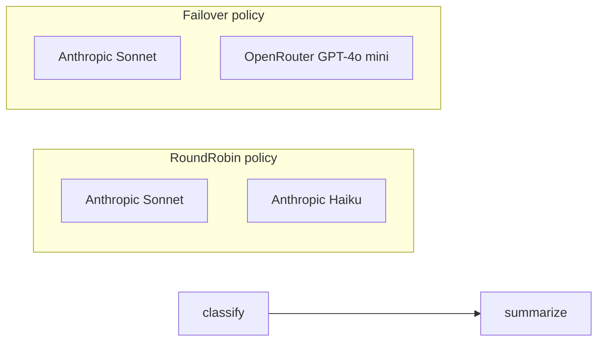
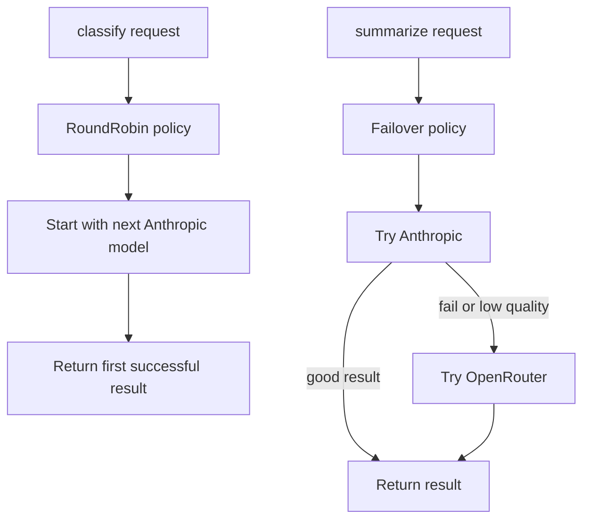

# AgentWithFallback

Route LLM calls through fallback policies instead of hard-coding a single model.

This sample runs a two-step incident workflow:

* `classify` uses a **RoundRobin** policy
* `summarize` uses a **Failover** policy with a quality gate

## What it demonstrates

* registering multiple LLM providers in one app
* using named fallback policies
* load-balancing requests with `RoundRobin`
* falling back across providers with `Failover`
* attaching a `fallbackPolicy` to a workflow node
* seeing which model actually handled each step

## Flow



## Run it

Set both API keys:

```bash
# bash
export ANTHROPIC_API_KEY="your-anthropic-key"
export OPENROUTER_API_KEY="your-openrouter-key"

# PowerShell
$env:ANTHROPIC_API_KEY="your-anthropic-key"
$env:OPENROUTER_API_KEY="your-openrouter-key"
```

Then run:

```bash
cd samples/AgentWithFallback
dotnet run
```

Or pass your own incident report:

```bash
dotnet run -- "Redis cluster in eu-west-1 lost quorum at 14:30 UTC. 3 of 5 nodes unreachable. Cache miss rate spiked to 87%. Application latency increased 4x."
```

## What happens

The workflow has two prompt nodes:

* `classify` decides the severity
* `summarize` writes the incident summary

Each node uses a different fallback policy:

* `load-balanced` rotates between two Anthropic models
* `failover-chain` tries Anthropic first, then OpenRouter if needed

## Example output

```text
═══ INCIDENT RESPONSE ═══
  Severity : critical
  Model    : anthropic/claude-haiku-4-5-20251001

  Summary:
  **Incident Summary - Critical**

  At 03:47 UTC, the primary PostgreSQL replica in us-east-1 failed due to a long-running analytical query...
  
  Model    : anthropic/claude-sonnet-4-20250514

Errors: 0
```

## Response idea

In this run:

* the `classify` step was handled by **Anthropic Haiku**
* the `summarize` step was handled by **Anthropic Sonnet**
* no fallback was needed because both responses succeeded

So even though fallback policies were configured, the workflow completed on the first provider choice for each step.

## Policy behavior



## Why this sample matters

Use fallback policies when you want more resilient LLM execution, for example:

* spreading traffic across models
* protecting against provider outages
* adding backup providers
* enforcing minimum response quality
* keeping workflows running without changing workflow code

## Key idea

The workflow stays the same.

Only the node parameter changes:

```json
{
  "fallbackPolicy": "load-balanced"
}
```

or:

```json
{
  "fallbackPolicy": "failover-chain"
}
```

That lets you change routing behavior without rewriting the workflow logic.
