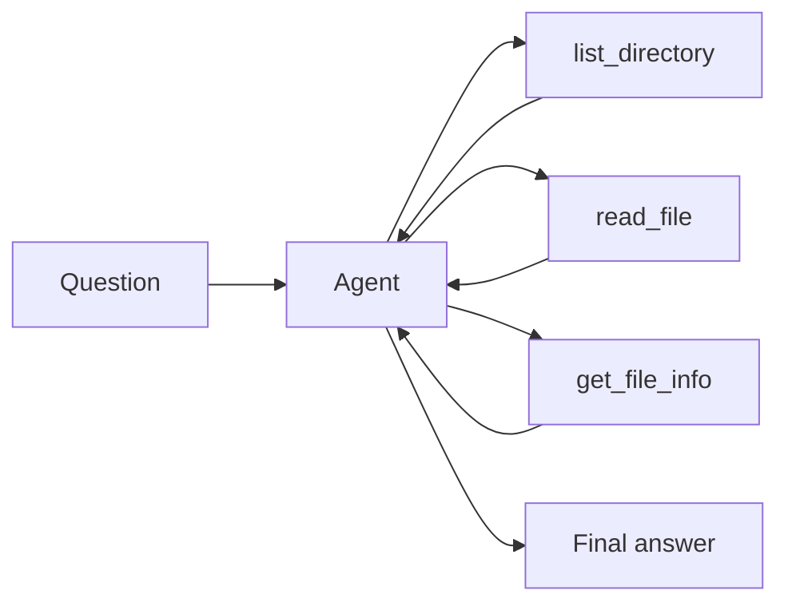
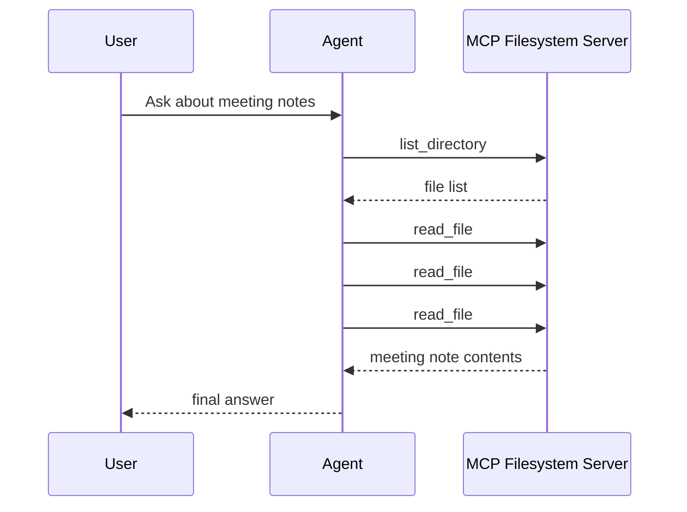

# AgentWithMcp

Use MCP tools inside an agent workflow just like native Spectra tools.

This sample connects to the MCP filesystem server, lets the agent read meeting notes from disk, and answer questions by inspecting those files.

## What it demonstrates

* connecting Spectra to an MCP server with `AddMcpServer(...)`
* discovering MCP tools at host startup
* using MCP tools inside an `agent` step
* restricting the agent to a safe read-only tool list
* answering questions from local files without writing custom tools

## Flow



## Prerequisites

* Node.js with `npx` available
* OpenRouter API key

```bash id="4lebtn"
# bash
export OPENROUTER_API_KEY="your-key"

# PowerShell
$env:OPENROUTER_API_KEY="your-key"
```

## Run it

```bash id="j8nqcm"
cd samples/AgentWithMcp
dotnet run
```

## What happens

At startup, Spectra connects to the MCP filesystem server and registers three tools:

* `mcp__filesystem__list_directory`
* `mcp__filesystem__read_file`
* `mcp__filesystem__get_file_info`

The workflow asks the agent to answer a question about meeting notes.
To do that, the agent:

1. lists the available files
2. reads the relevant meeting note files
3. combines the results into one response

## Example output

```text id="oj3r4u"
Assistant:
## Open Action Items by Owner

### Alice (PM)
1. Update roadmap doc and share with stakeholders - due 2024-11-07
2. Announce focus hours policy to the whole company - due 2024-11-21

### Bob (Backend)
1. Implement Redis rate limiter with in-memory fallback - due 2024-11-22
2. Add auth middleware to POST /admin/config - due 2024-11-13 (urgent)
3. Run load tests on in-memory fallback - due 2024-11-20
4. Set up rate limiter alerting in Grafana - due 2024-11-29

### Carol (Design)
1. Share component library migration guide with the team - due 2024-11-08
2. Complete dashboard design migration - due 2024-11-29

### David (QA)
1. Draft QA checklist for design system migration - due 2024-11-15
2. Write search rewrite scoping document - due 2024-11-29

### Eve (DevOps)
1. Provision Redis in production environment - due 2024-11-15

### Frank (Security)
1. Re-verify POST /admin/config after Bob's fix - due 2024-11-14
2. Draft security checklist for PR template - due 2024-11-22 (async)

Tool-call iterations: 5
Stop reason: stop
Errors: 0
```

## Response idea

For the default question, the agent first discovers which meeting files exist, then reads all three files, then groups the action items by owner.

So the important part is not just the final answer. It is that the agent used external MCP tools to find and read the source material before answering.

## MCP tool loop



## Why this sample matters

Use MCP when tools live outside your app and you want the agent to access them through a standard protocol, for example:

* files
* databases
* developer tools
* internal systems
* third-party integrations

This lets the workflow use external tools without changing how the agent step works.

## Try other questions

```text id="7dqarf"
What was decided about the API rate limiting?
Summarise the product roadmap meeting in one paragraph.
Which meetings did Alice attend?
List every decision made in November 2024.
```
