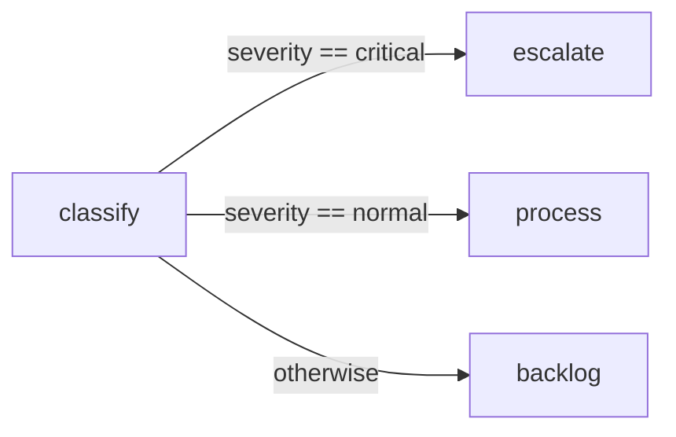
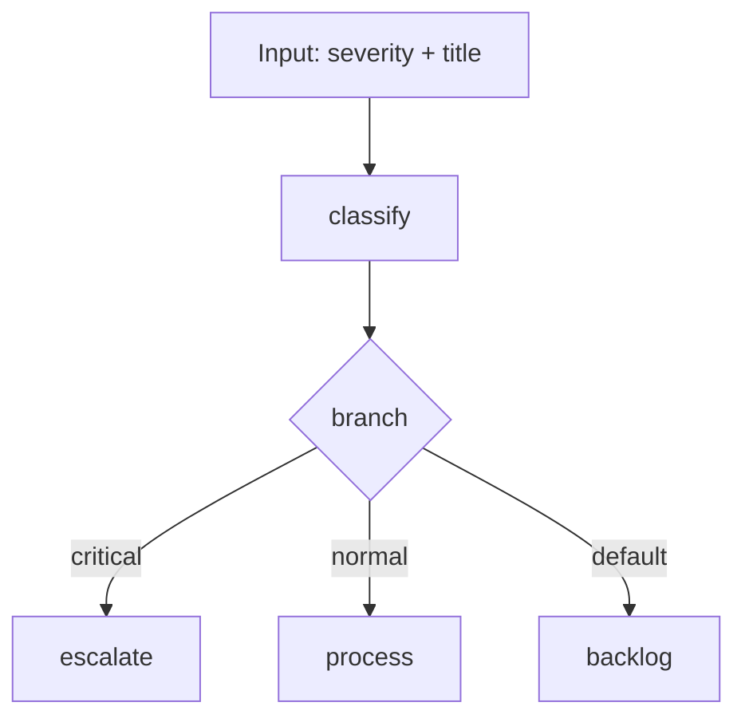

# BranchingWorkflow

Route a workflow to different paths based on data from an earlier step.

This sample classifies a support ticket, then uses conditional edges to send it to the right queue.

## What it demonstrates

* conditional edges in a workflow
* reading values from earlier step output with `Context.classify.severity`
* routing to different nodes based on branch conditions
* using a fallback branch when no condition matches

## Flow



## Run it

```bash
cd samples/BranchingWorkflow
dotnet run
```

Try different severities:

```bash
dotnet run critical "Database connection pool exhausted"
dotnet run normal "User cannot reset password"
dotnet run low "Update footer copyright"
```

## What happens

The workflow starts at `classify`.

That step reads:

* `severity`
* `title`

Then the outgoing edges are evaluated:

* if severity is `critical`, the ticket goes to `escalate`
* if severity is `normal`, the ticket goes to `process`
* otherwise, it goes to `backlog`

## Example output

```text
  [classify] Ticket: "User cannot reset password" → severity: normal
  [handle] → Routed to [NORMAL — Standard Queue] queue: "User cannot reset password"

Errors: 0
```

## Response idea

With this input:

```text
severity = normal
title    = User cannot reset password
```

the workflow does this:

1. `classify` writes `severity = normal` to workflow context
2. the `critical` branch is checked and skipped
3. the `normal` branch matches
4. `process` runs
5. the workflow completes

So only one branch runs.

## Why this sample matters

Use branching when the next step depends on earlier output, for example:

* ticket routing
* approval paths
* fraud checks
* escalation rules
* fallback handling

## Workflow shape



## Key idea

The conditions live on the edges, not inside the step implementation.

In this sample, the workflow checks:

```text
Context.classify.severity == 'critical'
Context.classify.severity == 'normal'
```

That keeps the step simple and puts routing logic in the workflow definition.
