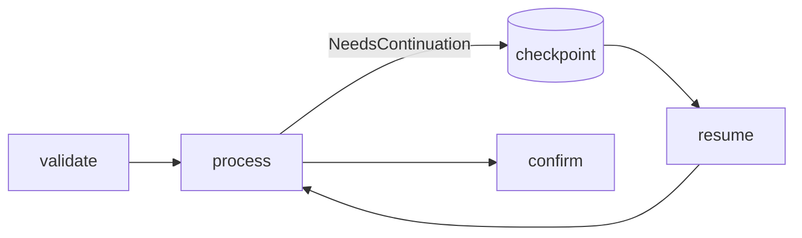
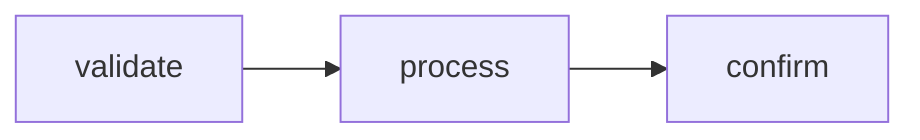

# CheckpointResume

Pause a workflow, save its state to disk, then resume it later.

This sample shows how a step can return `NeedsContinuation`, how Spectra writes a file checkpoint, and how the workflow continues from that saved state.

## What it demonstrates

* file-based checkpoints with `AddFileCheckpoints(...)`
* pausing a workflow with `StepStatus.NeedsContinuation`
* resuming a run with `ResumeAsync(...)`
* loading a checkpoint from disk for inspection
* continuing the workflow after an interruption

## Flow



## Run it

```bash
cd samples/CheckpointResume
dotnet run
```

## What happens

The workflow has three steps:

* `validate` checks the order
* `process` pauses the workflow the first time
* `confirm` runs only after resume

The sample runs in two phases:

* **Run 1** starts the workflow and stops at `process`
* the checkpoint is loaded from disk and printed
* **Run 2** resumes the same run and finishes the workflow

## Example output

```text
═══ RUN 1: Starting order pipeline ═══

  [validate] Order ORD-2026-0042 ($1,250.00) - valid
  [process] Payment submitted - awaiting confirmation...
  [process] Returning NeedsContinuation (workflow will pause)

Run 1 stopped. RunId: cab9e63d-a628-42d3-8f93-73a786f1ddc9
Errors: 0

═══ CHECKPOINT INSPECTION ═══

  Status      : InProgress
  Last node   :
  Next node   : process
  Steps done  : 1

═══ RUN 2: Resuming from checkpoint ═══

  [validate] Order ORD-2026-0042 ($1,250.00) - valid
  [process] Payment confirmed!
  [confirm] Order confirmed. Transaction: TXN-1200d9c8

Run 2 completed. Errors: 0
```

## Response idea

After the first run, the workflow is not failed. It is paused.

The checkpoint shows:

* the run is still **InProgress**
* the next step is **process**
* one step has already completed

After resume, the workflow continues and finishes successfully.

## Workflow shape



## Why this sample matters

Use checkpoints when a workflow cannot finish in one pass, for example when waiting for:

* payment confirmation
* human approval
* an external callback
* a long-running background process

Instead of starting over, you resume the same run from saved state.
