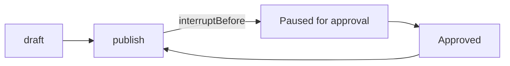
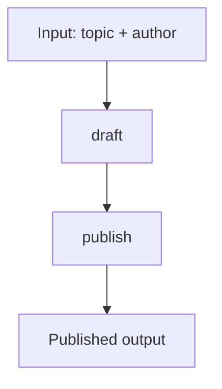

# InterruptApproval

Pause a workflow for human approval before a step runs.

This sample generates draft content, stops before publishing, saves an interrupt checkpoint, then resumes after an approval response.

## What it demonstrates

* declarative interrupts with `interruptBefore`
* checkpointing interrupted runs to disk
* inspecting a pending interrupt from the checkpoint store
* resuming with `ResumeWithResponseAsync(...)`
* approving a paused step before it executes

## Flow



## Run it

```bash
cd samples/InterruptApproval
dotnet run
```

## What happens

The workflow has two nodes:

* `draft` creates the content
* `publish` is marked with `interruptBefore`

On the first run:

* `draft` runs normally
* execution reaches `publish`
* Spectra pauses before the step executes
* a checkpoint is saved with interrupt details

Then the sample:

* loads the checkpoint
* prints the pending interrupt
* sends an approval response
* resumes the same run

After approval, `publish` runs and the workflow finishes.

## Example output

```text
═══ RUN 1: Content pipeline - will pause for review ═══

  [draft] Generated draft for "Spectra v1.0 Release Notes" by Alican
  [draft] Content: 109 chars

Run 1 paused. RunId: 3f5c07bb-a378-43c0-a78e-02f7ef3f2e29
Errors: 0

═══ CHECKPOINT: Waiting for approval ═══

  Status           : Interrupted
  Next node        : publish
  Steps done       : 1
  Pending interrupt: yes
  Reason           : Content must be reviewed and approved before publishing
  Title            : Interrupt before 'publish'

═══ RUN 2: Approving and resuming ═══

  [publish] Publishing "Spectra v1.0 Release Notes" - approved and live!

Run 2 completed. Errors: 0
```

## Response idea

After the first run, the workflow is not failed and not completed.

It is:

* checkpointed with status `Interrupted`
* waiting at the `publish` node
* holding a pending interrupt request with the review reason

Once an approval response is passed to `ResumeWithResponseAsync(...)`, the interrupt is cleared and the workflow continues.

## Workflow shape



## Why this sample matters

Use interrupts when a workflow must stop for a decision before continuing, for example:

* content approval
* legal review
* manager sign-off
* manual verification
* deployment approval

The step does not need to implement pause logic itself. The workflow definition controls it with `interruptBefore`.
