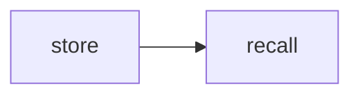
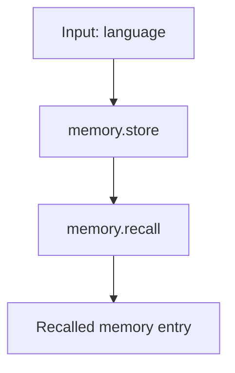

# MemoryStoreRecall

Store a value in memory in one step, then recall it in the next.

This sample uses Spectra's built-in memory steps with an in-memory store, so it runs without any API key or external service.

## What it demonstrates

* storing a memory with `memory.store`
* recalling a memory with `memory.recall`
* scoping memories with a namespace
* passing data across nodes through the memory store
* using `AddInMemoryMemory()` for local development

## Flow



## Run it

```bash
cd samples/MemoryStoreRecall
dotnet run
```

Try a different value:

```bash
dotnet run -- Rust
dotnet run -- Python
```

## What happens

The workflow has two nodes:

* `store` saves the input language to memory
* `recall` looks up that same memory by namespace and key

The stored memory uses:

* namespace: `user-preferences`
* key: `favorite-language`

## Example output

```text
Storing preference: language = "C#"

Store  → stored: True, action: created, key: favorite-language
Recall → found: True, count: 1
         namespace: user-preferences, key: favorite-language, content: "C#"

Errors: 0
```

## Response idea

For this run:

```text
language = C#
```

the workflow does this:

1. stores `"C#"` under `user-preferences / favorite-language`
2. recalls it in the next node
3. returns one matching memory

So the result shows that the memory written by `store` is immediately available to `recall`.

## Workflow shape



## Why this sample matters

Use memory steps when workflows need to keep facts for later use, for example:

* user preferences
* onboarding details
* remembered settings
* reusable context between nodes

This sample keeps everything in memory for the current process, which makes it good for demos and local testing.
