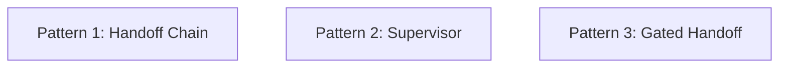
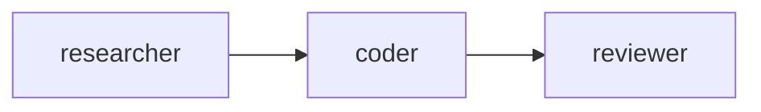
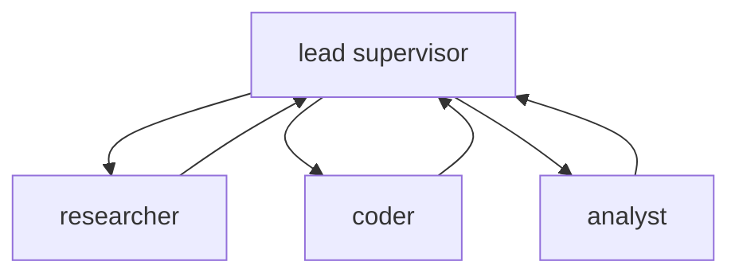
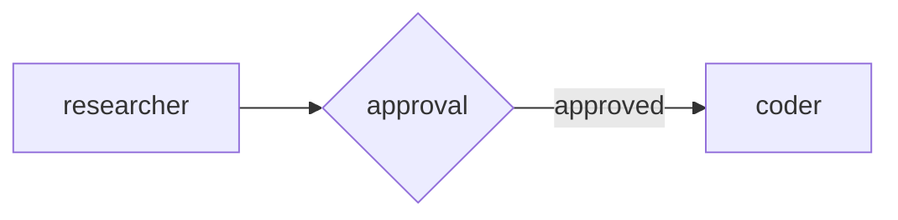

# MultiAgent

Configure multi-agent workflows with handoffs, supervisors, and approval gates.

This sample does not run real LLM calls. It shows how to define common multi-agent patterns in Spectra using the workflow builder.

## What it demonstrates

* agent-to-agent handoff chains
* supervisor and worker teams
* approval-gated handoffs
* conversation scope settings
* token budgets and iteration limits
* delegation and cycle control

## Patterns in this sample



## Run it

```bash
cd samples/MultiAgent
dotnet run
```

## Example output

```text
=== Spectra Multi-Agent Patterns ===

--- Pattern 1: Handoff Chain ---
  Workflow: Research → Code → Review Pipeline
  Agents: researcher → coder → reviewer
  Global token budget: 200,000

--- Pattern 2: Supervisor ---
  Workflow: Supervised Team
  Supervisor: lead
  Workers: researcher, coder, analyst
  Max delegation depth: 2

--- Pattern 3: Gated Handoff ---
  Workflow: Gated Research → Code Pipeline
  Handoff policy: RequiresApproval
  Conversation scope: LastN (last 5)

=== All patterns configured successfully ===
```

## Pattern 1: Handoff chain

A task moves from one specialist to the next.

* `researcher` can hand off to `coder`
* `coder` can hand off to `reviewer`



This is useful when work naturally moves through stages like:

* research
* implementation
* review

## Pattern 2: Supervisor

A lead agent coordinates specialist workers.

* `lead` acts as the supervisor
* `researcher`, `coder`, and `analyst` are workers



This is useful when one agent should break down the task, delegate parts, and combine the results.

## Pattern 3: Gated handoff

A handoff is allowed only after approval.

* `researcher` can hand off to `coder`
* the handoff policy is `RequiresApproval`



This is useful when moving work to the next agent should be reviewed first.

## Response idea

This sample is about **configuration**, not execution.

When you run it, it prints the workflow setup so you can verify that:

* agents were registered correctly
* handoff and delegation rules are in place
* limits like token budgets and depth are attached to the workflow

## Why this sample matters

Use multi-agent patterns when one agent is not enough and you want clear roles, for example:

* researcher → coder → reviewer flows
* team lead with specialist workers
* approval-controlled transitions
* bounded multi-step collaboration

## Key idea

Each pattern is still just a workflow.

The difference is how agents are connected:

* **handoff** passes work from one specialist to another
* **supervisor** coordinates several workers
* **gated handoff** adds approval before the next agent can take over
