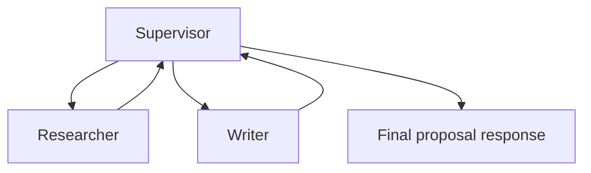
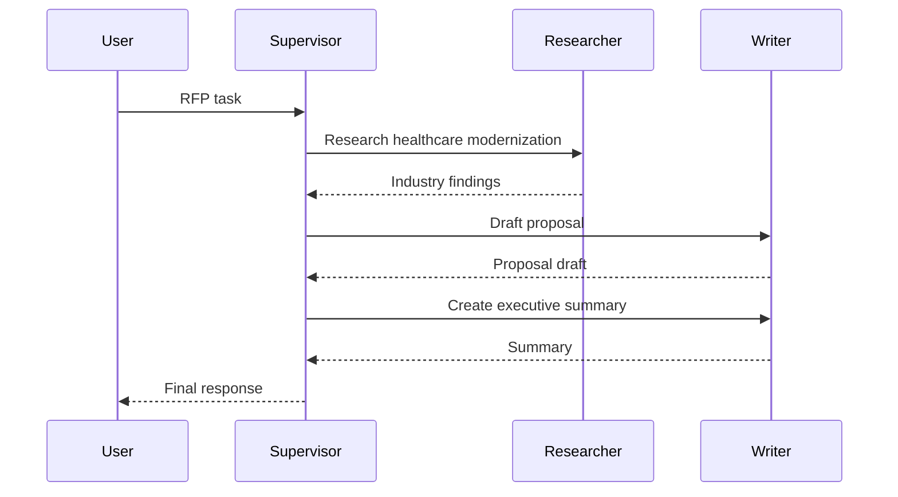

# MultiAgentSupervisor

Coordinate specialist agents with a supervisor.

This sample shows a supervisor agent delegating work to two workers:

* `researcher`
* `writer`

The supervisor collects their results and returns the final RFP response.

## What it demonstrates

* the supervisor pattern with `AsSupervisor(...)`
* delegating work to named worker agents
* using the built-in `delegate_to_agent` tool
* combining worker results into one final response
* tracking total iterations and token usage

## Flow



## Run it

Set your API key:

```bash
# bash
export OPENROUTER_API_KEY="your-key"

# PowerShell
$env:OPENROUTER_API_KEY="your-key"
```

Then run:

```bash
cd samples/MultiAgentSupervisor
dotnet run
```

## What happens

The workflow has one main node: `coordinate`.

That node runs the supervisor agent, which:

1. delegates industry research to `researcher`
2. delegates proposal drafting to `writer`
3. asks for a final executive summary
4. returns the final proposal response

## Example output

```text
═══ FINAL RESULT ═══
### Final Proposal Response for Meridian Healthcare Group

#### Executive Summary

Meridian Healthcare Group is poised to enhance its operational efficiency and patient care through strategic improvements in healthcare technology. Our proposal outlines a comprehensive approach focused on three critical areas: HIPAA compliance, real-time analytics, and Electronic Health Record (EHR) integration.

...

Total LLM iterations: 3
Tokens: 3329 input + 620 output

Errors: 0
```

## Response idea

For this run, the supervisor did not write the whole answer alone.

It delegated work in stages:

* the `researcher` returned healthcare cloud migration findings
* the `writer` drafted the proposal content
* the `writer` was then used again to produce a tighter executive summary
* the supervisor returned the final combined answer

So the key idea is orchestration: one agent manages the process, while specialists do the focused work.

## Delegation pattern



## Why this sample matters

Use a supervisor when one agent should coordinate several specialists, for example:

* proposal generation
* consulting deliverables
* research plus writing workflows
* lead agent with domain experts

This pattern keeps responsibilities clear: the supervisor manages the flow, and the workers focus on their own tasks.
