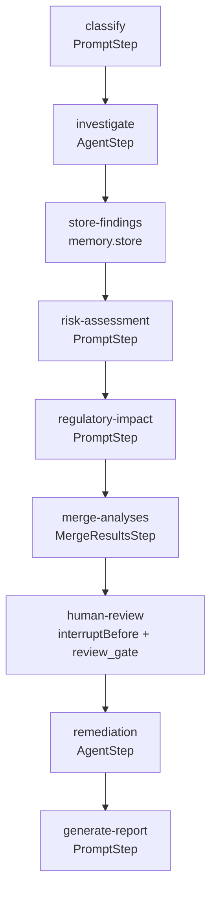
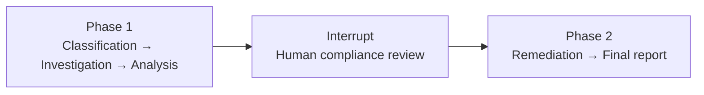
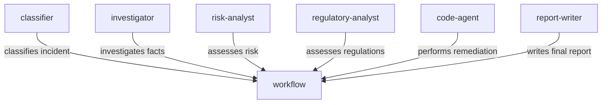
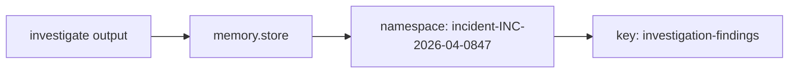
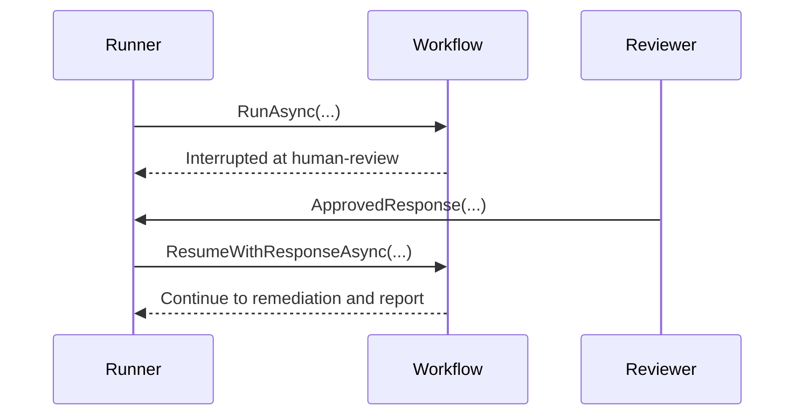
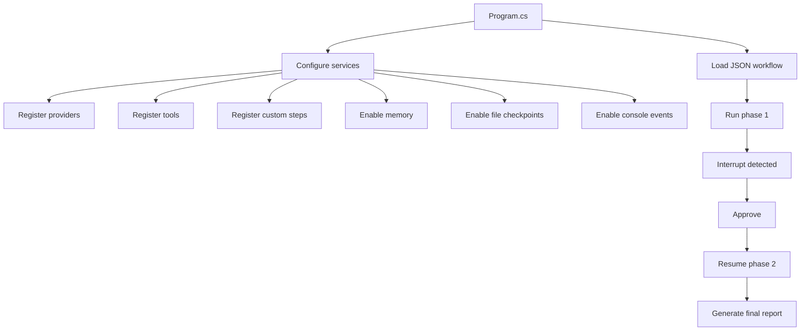

# ResearchPipeline — The Final Boss

> A capstone Spectra sample combining classification, investigation, memory, human approval, remediation, and final reporting into one realistic compliance workflow.

---

## Overview

This sample models a **Compliance Incident Analysis Pipeline** for a financial services firm. Starting from a suspicious trading incident, the workflow investigates the facts, assesses risk and regulatory impact, pauses for human review, performs remediation, and generates a final compliance report.

---

## What It Demonstrates

- JSON-defined workflow
- `PromptStep` and `AgentStep`
- Custom `IStep` implementations
- Custom `ITool` implementations
- `memory.store`
- Declarative `interruptBefore`
- `ResumeWithResponseAsync(...)`
- File checkpointing
- Console event streaming
- Multi-phase execution with interruption and resume

---

## Scenario

An automated surveillance system detects suspicious trading activity on desk **FX-7**.

| Detail | Value |
|---|---|
| Counterparty concentration exceeded by | **112%** |
| Trade pattern | Multiple large trades in rapid succession |
| Compliance gap | Several trades lacked required pre-trade approval |
| Pattern signature | **Layering** |
| Executing trader | `K. Patel` |
| Counterparty | `Meridian Capital` |

The workflow turns this raw report into a structured compliance outcome.

---

## Architecture



---

## Execution Phases



---

## Node Breakdown

| Node | Type | Role |
|---|---|---|
| `classify` | `prompt` | Classifies the incident |
| `investigate` | `agent` | Investigates the case using tools |
| `store-findings` | `memory.store` | Persists findings into memory |
| `risk-assessment` | `prompt` | Produces structured risk analysis |
| `regulatory-impact` | `prompt` | Produces regulatory analysis |
| `merge-analyses` | custom step | Combines both analysis outputs |
| `human-review` | custom step + interrupt | Requires approval before remediation |
| `remediation` | `agent` | Performs remediation logic |
| `generate-report` | `prompt` | Produces the final compliance report |

---

## Agent Roles



---

## Custom Steps

### `MergeResultsStep`

Combines outputs from `risk-assessment` and `regulatory-impact`, and stores the merged result as a single object in workflow context.

### `ReviewGateStep`

A lightweight passthrough step. The actual pause is triggered declaratively via `interruptBefore`.

---

## Custom Tools

### Investigation Tools

#### `search_incidents`
Searches simulated internal incident history for related past incidents.

#### `query_transactions`
Queries simulated transaction patterns, including:
- Suspicious activity
- Volume concentration
- Approval failures
- Trader history

### File Tools

#### `read_file`
Reads a file from disk.

#### `write_file`
Writes content to a file on disk.

These are intended for use in remediation flows.

---

## Memory Flow



Investigation results are stored under:

- **namespace:** `incident-{{inputs.incidentId}}`
- **key:** `investigation-findings`

This demonstrates how findings can persist beyond a single node.

---

## Human-in-the-Loop Review

The review node uses declarative interruption:

```json
"interruptBefore": "Compliance officer must review analysis results before automated remediation proceeds. Review the risk assessment and regulatory impact analysis."
```

Workflow behavior:

1. Runs until `human-review`
2. Pauses before execution
3. Waits for a response
4. Resumes only after approval or rejection

---

## Resume Flow



Example resume call:

```csharp
var approval = InterruptResponse.ApprovedResponse(
    respondedBy: "sarah.chen@compliance.internal",
    comment: "Approved. Flag all Meridian Capital transactions and escalate to desk head upon return.");

result = await runner.ResumeWithResponseAsync(workflow, result.RunId, approval);
```

---

## Checkpointing

File-based checkpointing ensures progress survives interruption and resume safely.

| Setting | Value |
|---|---|
| Checkpoint frequency | Every node |
| Checkpoint on interrupt | Enabled |

---

## Program Structure



---

## Workflow Definition Highlights

The workflow is loaded from JSON using `JsonFileWorkflowStore`.

Key aspects:

- `entryNodeId` starts at `classify`
- The workflow is linear in structure
- Review uses declarative interruption
- Remediation is agent-driven
- Memory is used explicitly via `memory.store`

---

## What Happens in Practice

### Phase 1

1. Incident is classified — typically as `MARKET_ABUSE`
2. Investigator agent compiles findings
3. Findings are stored in memory
4. Risk analysis is produced
5. Regulatory analysis is produced
6. Analyses are merged
7. Workflow pauses for human review

### Phase 2

1. Approval is supplied
2. Workflow resumes
3. Remediation agent executes remediation instructions
4. Final report is generated

---

## Current State & Limitations

> **Note:** Although the sample description mentions subgraphs and parallel fan-out, the provided workflow JSON is currently **linear**:
> - `risk-assessment` flows into `regulatory-impact` sequentially
> - `subgraphs` is empty
> - `remediation` is a normal agent node, not a subgraph

This sample currently demonstrates interruption/resume, memory, custom steps, agent + prompt composition, and checkpointing — but **not yet** true parallel branching or subgraph execution.

---

## Suggested Improvements

To fully match the "Final Boss" positioning, recommended next upgrades:

1. Make `risk-assessment` and `regulatory-impact` true parallel branches
2. Add explicit `WaitForAll` semantics
3. Move remediation into a real subgraph
4. Have remediation actually use `read_file` / `write_file` tools instead of only describing code
5. Seed a real CSV input file and verify output mutation after remediation

---

## Running the Sample

### Prerequisites

```bash
# bash
export OPENROUTER_API_KEY="your-key"

# PowerShell
$env:OPENROUTER_API_KEY="your-key"
```

### Command

```bash
cd samples/ResearchPipeline
dotnet run
```

---

## Outcome

The final output is a structured compliance incident report covering:

- Executive summary
- Classification
- Investigation findings
- Risk assessment
- Regulatory impact
- Remediation actions
- Recommendations

---

## Why This Sample Matters

This is the strongest "systems" sample in the set. It shows that Spectra is not just for isolated prompts or toy agent loops — it can orchestrate a realistic workflow with:

- **Deterministic steps** for structured processing
- **Agentic investigation** for open-ended fact-finding
- **Persistent state** via memory
- **Human approval gates** for compliance requirements
- **Resumability** across interruptions
- **Operational visibility** through console event streaming

That makes it a strong showcase for enterprise-grade orchestration scenarios.