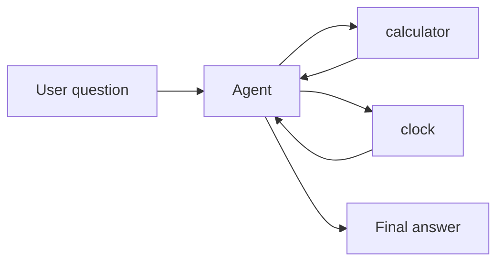
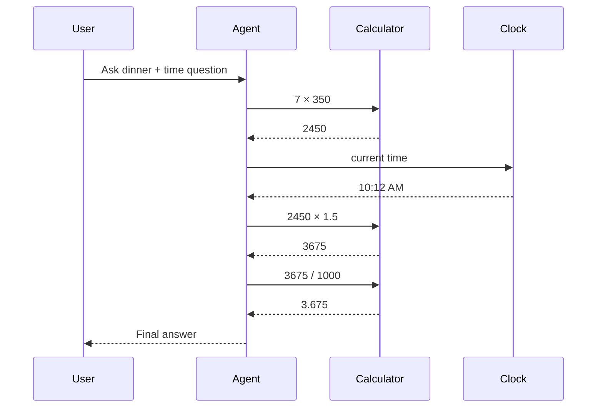

# SingleAgent

Run an autonomous agent that can use tools to solve a multi-step question.

This sample gives the agent two custom tools:

* `calculator`
* `clock`

The agent decides when to call them, uses the results, and then writes the final answer.

## What it demonstrates

* using the `agent` step
* registering custom tools with `AddTool(...)`
* limiting the agent to specific tools
* letting the agent call tools across multiple iterations
* returning a final answer plus iteration metadata

## Flow



## Run it

Set your API key:

```bash
# bash
export OPENROUTER_API_KEY="your-key"

# PowerShell
$env:OPENROUTER_API_KEY="your-key"
```

Then run:

```bash
cd samples/SingleAgent
dotnet run
```

## What happens

The input asks two things:

* how much food to buy
* what time it is right now

The agent does not answer everything in one shot. It works in steps:

1. calls `calculator` to compute `7 × 350`
2. calls `clock` to get the current time
3. calls `calculator` again to multiply by `1.5`
4. calls `calculator` again to convert grams to kilograms
5. writes the final response

## Example output

```text
Agent answer:
For your dinner party of 7 people, you'll need to buy a total of **3.675 kilograms** of food.

As for the time, it is currently **10:12 AM**. You still have plenty of time to go shopping today!

Tool-call iterations: 4
Stop reason: stop
Errors: 0
```

## Response idea

For this run, the agent used tools instead of doing the work itself:

* `7 * 350 = 2450`
* `2450 * 1.5 = 3675`
* `3675 / 1000 = 3.675`
* current time was read from the `clock` tool

Then it combined those results into one final answer.

## Tool loop



## Why this sample matters

Use an agent step when the model needs to decide:

* which tools to use
* in what order to use them
* how to combine the results into a final answer

This is a good fit for assistant-style workflows that need reasoning plus tool use.
