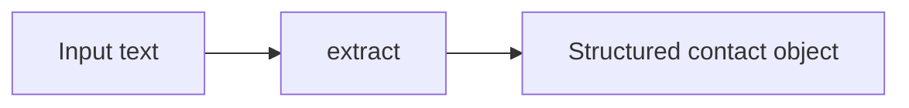

# StructuredOutput

Extract structured data from plain text with `StructuredOutputStep`.

This sample takes a block of text, asks the model to return contact details in a specific JSON shape, and stores the parsed result in workflow context.

## What it demonstrates

* using the `structured_output` step
* passing a JSON schema to describe the expected shape
* extracting fields like name, company, email, phone, and role
* reading structured values from `result.Context["extract"]`

## Flow



## Run it

Set your API key:

```bash
# bash
export OPENROUTER_API_KEY="your-key"

# PowerShell
$env:OPENROUTER_API_KEY="your-key"
```

Then run:

```bash
cd samples/StructuredOutput
dotnet run
```

## Example output

```text
[WorkflowStartedEvent] Extract Contact Info
[StepStartedEvent] Node=extract StepType=structured_output
[StepCompletedEvent] Node=extract Status=Succeeded
[WorkflowCompletedEvent] Success=true StepsExecuted=1

Extracted contact:
  name      : Jordan Patel
  company   : NovaByte Systems
  email     : jordan.patel@novabyte.io
  phone     : +1 512 340 8821
  role      : Senior Engineering Manager

Errors: 0
```

## Response shape

The `structured_output` step returns a plain object that matches the schema you provide.

For this sample, the result looks like:

```json
{
  "name": "Jordan Patel",
  "company": "NovaByte Systems",
  "email": "jordan.patel@novabyte.io",
  "phone": "+1 512 340 8821",
  "role": "Senior Engineering Manager"
}
```

That object is stored under the node id:

```csharp
result.Context["extract"]
```

## Why this sample is useful

Use `StructuredOutputStep` when you want the model to return data your code can read directly, instead of free-form text. It is a good fit for tasks like extraction, classification, and form-style outputs.
