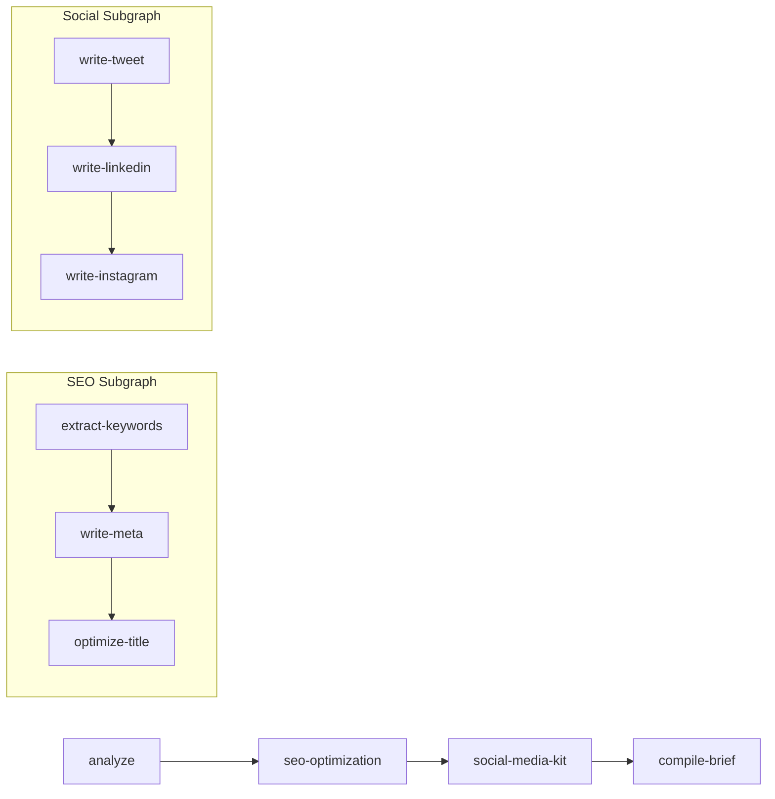
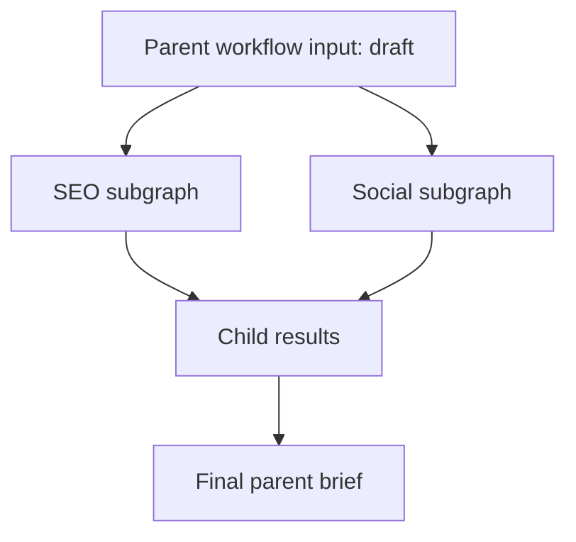

# SubgraphComposition

Compose a workflow from smaller child workflows.

This sample shows how a parent workflow can delegate part of the job to subgraphs. The main pipeline analyzes a draft, runs an SEO subgraph, runs a social media subgraph, then compiles everything into a final publishing brief.

## What it demonstrates

* using `subgraph` nodes inside a parent workflow
* passing inputs from parent to child with `inputMappings`
* keeping child workflow state isolated
* returning child results back to the parent
* composing a larger workflow from smaller reusable workflow units

## Flow



## Run it

Set your API key:

```bash
# bash
export OPENROUTER_API_KEY="your-key"

# PowerShell
$env:OPENROUTER_API_KEY="your-key"
```

Then run:

```bash
cd samples/SubgraphComposition
dotnet run
```

Or pass your own draft text:

```bash
dotnet run -- "Your article draft here..."
```

## What happens

The parent workflow has 4 main nodes:

* `analyze`
* `seo-optimization`
* `social-media-kit`
* `compile-brief`

Two of those nodes are subgraphs:

* `seo-optimization` runs a child workflow for keywords, meta description, and titles
* `social-media-kit` runs a child workflow for tweet, LinkedIn post, and Instagram caption

The parent passes data into each subgraph, waits for it to finish, then uses the child results in the final brief.

## Example output

```text
═══ Content Publishing Pipeline ═══
Loaded: Content Publishing Pipeline
  Main nodes: 4
  Subgraphs:  2
  Agents:     8

Running pipeline...

✓ Pipeline completed successfully

── Content Analysis ──
- Primary topic: Agentic AI
- Target audience: Enterprises in automation sectors
- Tone: Professional

══ Final Publishing Brief ══
# Publishing Brief

## 1. Content Analysis
...

## 2. SEO Package
...

## 3. Social Media Kit
...

## 4. Publishing Checklist
...
```

## Response idea

For this run, the workflow does not try to generate everything in one step.

Instead it breaks the work into layers:

1. the parent workflow analyzes the article
2. the SEO subgraph generates search-focused outputs
3. the social subgraph generates channel-specific posts
4. the parent combines all of it into one publishing brief

That makes the workflow easier to organize and easier to reuse.

## Parent vs child workflows



## Why this sample matters

Use subgraphs when part of a workflow should be grouped into its own mini-workflow, for example:

* SEO processing
* approval flows
* channel-specific content generation
* reusable business logic
* isolated specialist pipelines

Subgraphs help keep large workflows modular instead of putting everything in one flat graph.

## Key idea

A subgraph is still just a workflow.

The parent workflow calls it like a step, passes in only the values it needs, and gets back child results when it finishes.
